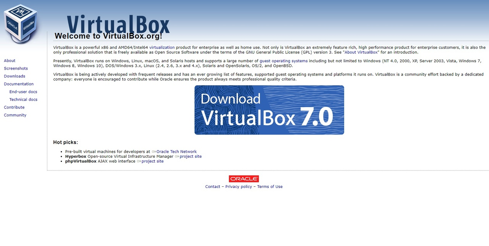
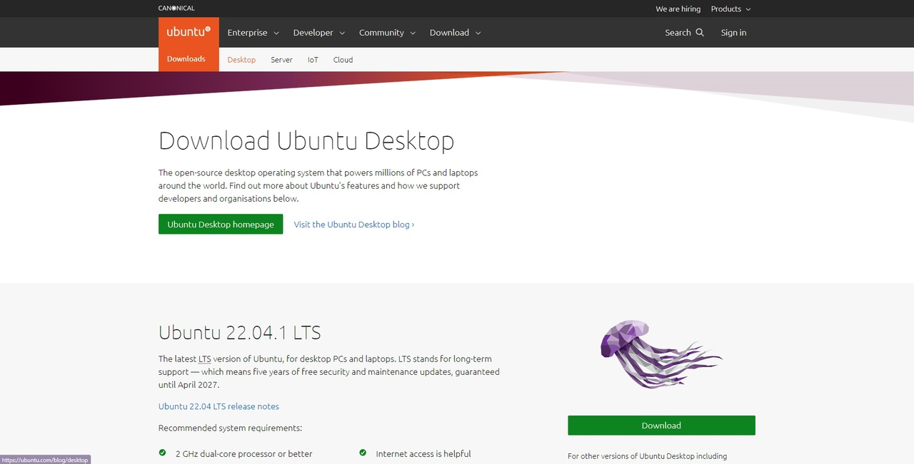
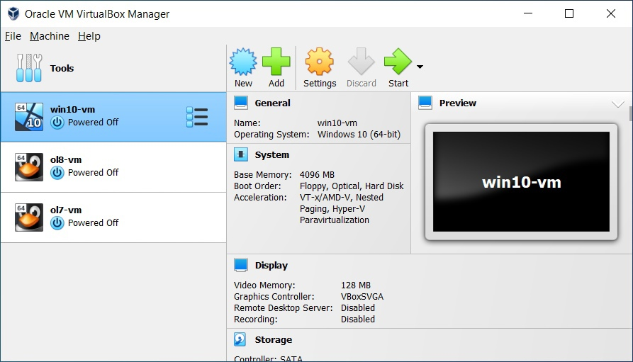
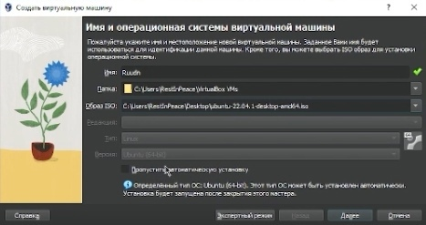
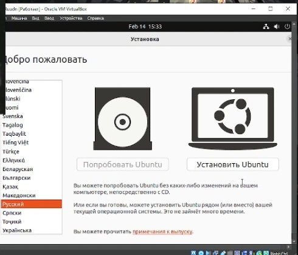
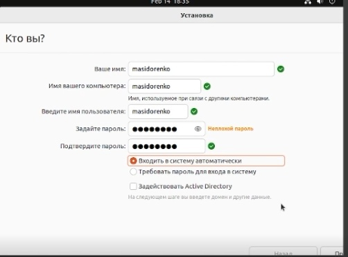
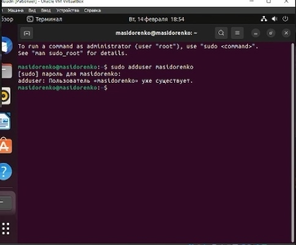
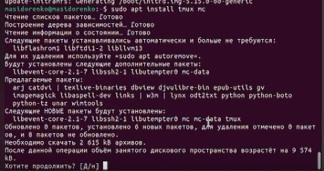
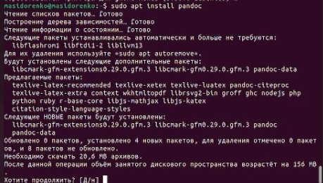

---
## Front matter
lang: ru-RU
title: Презентация лабораторной работы №1
author:
  - Сидоренко Максим Алексеевич
  - Группа НБИбд-02-22
institute:
  - Российский университет дружбы народов, Москва, Россия

## i18n babel
babel-lang: russian
babel-otherlangs: english

## Formatting pdf
toc: false
toc-title: Содержание
slide_level: 2
aspectratio: 169
section-titles: true
theme: metropolis
header-includes:
 - \metroset{progressbar=frametitle,sectionpage=progressbar,numbering=fraction}
 - '\makeatletter'
 - '\beamer@ignorenonframefalse'
 - '\makeatother'
---

# Цель работы 

## Цель работы

- Целью данной работы является приобретение практических навыков установки операционной системы на виртуальную машину, настройки минимально необходимых для дальнейшей работы сервисов.

# Задания

## Задания

- Создать виртуальную машину, настроить её
- Настроить операционную систему для работы 

# Создание виртуальной машины

- Устанавливаем Virtual Box и дистрибутив

{#fig:001 width=70%}

{#fig:001 width=70%}

## Создание виртуальной машины

- Устанавливаем Virtual Box и дистрибутив

{#fig:001 width=70%}

## Создаем Виртуальную машину и устанавливаем ОС

{#fig:001 width=70%}

## Создаем Виртуальную машину и устанавливаем ОС

{#fig:001 width=70%}

## Создаем Виртуальную машину и устанавливаем ОС

{#fig:001 width=70%}

## Создаем Виртуальную машину и устанавливаем ОС

{#fig:001 width=70%}

## Создаем Виртуальную машину и устанавливаем ОС

{#fig:001 width=70%}

# Настраиваем ОС для работы

Запускаем терминал, выдаем права суперпользователя, Устанавливаем ДОП ПО, Обновляем пакеты и систему 

{#fig:001 width=70%}

## Настраиваем ОС для работы

{#fig:001 width=70%}

## Настраиваем ОС для работы

{#fig:001 width=70%}

# Ответы на Контрольные вопросы

1) имя пользователя и пароль
2) info
   mv
   ls
   du
   mkdir/ rm -r/ 
   chmod
   history	
3) Файловая система — порядок, определяющий способ организации, хранения и именования данных на носителях информации в компьютерах, а также в другом электронном оборудовании: цифровых фотоаппаратах, мобильных телефонах и т. п.

4) Команда findmnt — это простая утилита командной строки, используемая для отображения списка смонтированных файловых систем или поиска файловой системы в /etc/fstab, /etc/mtab и /proc/self/mountinfo.

5) kill параметром "-9"

# Вывод

- После проделанной работы я приобрел практические навыкы установки операционной системы на виртуальную машину, настройки минимально необходимых для дальнейшей работы сервисов.

:::

