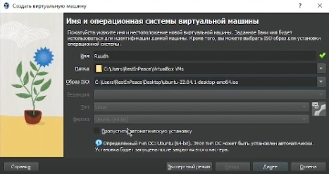

---
## Front matter
title: "Отчет по лабораторной работе №1"
subtitle: "Группа НБИбд-02-22"
author: "Сидоренко Максим Алексеевич"

## Generic otions
lang: ru-RU
toc-title: "Содержание"

## Bibliography
bibliography: bib/cite.bib
csl: pandoc/csl/gost-r-7-0-5-2008-numeric.csl

## Pdf output format
toc: true # Table of contents
toc-depth: 2
lof: true # List of figures
lot: true # List of tables
fontsize: 12pt
linestretch: 1.5
papersize: a4
documentclass: scrreprt
## I18n polyglossia
polyglossia-lang:
  name: russian
  options:
	- spelling=modern
	- babelshorthands=true
polyglossia-otherlangs:
  name: english
## I18n babel
babel-lang: russian
babel-otherlangs: english
## Fonts
mainfont: PT Serif
romanfont: PT Serif
sansfont: PT Sans
monofont: PT Mono
mainfontoptions: Ligatures=TeX
romanfontoptions: Ligatures=TeX
sansfontoptions: Ligatures=TeX,Scale=MatchLowercase
monofontoptions: Scale=MatchLowercase,Scale=0.9
## Biblatex
biblatex: true
biblio-style: "gost-numeric"
biblatexoptions:
  - parentracker=true
  - backend=biber
  - hyperref=auto
  - language=auto
  - autolang=other*
  - citestyle=gost-numeric
## Pandoc-crossref LaTeX customization
figureTitle: "Рис."
tableTitle: "Таблица"
listingTitle: "Листинг"
lofTitle: "Список иллюстраций"
lolTitle: "Листинги"
## Misc options
indent: true
header-includes:
  - \usepackage{indentfirst}
  - \usepackage{float} # keep figures where there are in the text
  - \floatplacement{figure}{H} # keep figures where there are in the text
---

# Примечание

Так как я выполнял работу не в дисплейном классе, а дома, то некоторые моменты пришлось изменить, ибо шаблон лабораторной работы сделан для дисплейного класса, я использовал дистрибутив Ubuntu вместо Fedora

# Цель работы

Целью данной работы является приобретение практических навыков установки операционной системы на виртуальную машину, настройки минимально необходимых для дальнейшей работы сервисов.

# Задание

1. Установить Virtual Box и операционную систему (дистрибутив) в образе ISO
2. Запустить Virtual box
3. Создать Виртуальную машину нажав кнопку создать, затем выбрать образ (дистрибутив)
4. Выделить кол-во ядер и оперативную память
5. Запустить Виртуальную машину, после выбрать русский язык, нажать установить
6. Заполнить пустые поля
7. Нажать кнопку далее, ждать окончание установки операционной системы
8. Запустить Linux
9. Запустить терминал, затем добавить пользователя в группу супер пользователей
10. Установить tmux mc
11. Установить pandoc и его версии
12. Установить все пакеты texlive

# Выполнение лабораторной работы

1) Я установил Virtual box и дистрибутив в образе ISO 

{#fig:001 width=70%}

2) запустил Virtual Box

{#fig:001 width=70%}

3) Создал виртуальную машину

{#fig:001 width=70%}

4) Выделил кол-во ядер и допустимое значение оперативной памяти

{#fig:001 width=70%}

5) После создания, я запустил виртуальную машину и нажал кнопку установить

{#fig:001 width=70%}

{#fig:001 width=70%}

6) Заполнил пустые поля, ввел имя пользователя и пароль

{#fig:001 width=70%}

7) После установки операционной системы, я запустил Linux

{#fig:001 width=70%}

8) После я запустил терминал и начал добавлять пользователя в группу суперпользователей 
при помощи строки sudo adduser masidorenko

{#fig:001 width=70%}

9) При помощи строки sudo apt upgrade/update, я обновил систему и пакеты файлов

{#fig:001 width=70%}

10) Установил дополнительное программное обеспечение, такие как, tmux mc, pandoc и все его пакеты, texlive и все его пакеты и версии

{#fig:001 width=70%}

{#fig:001 width=70%}

{#fig:001 width=70%}

{#fig:001 width=70%}

{#fig:001 width=70%}

{#fig:001 width=70%}

{#fig:001 width=70%}

{#fig:001 width=70%}

# Домашняя работа

Получите следующую информацию.

1)Версия ядра Linux (Linux version).

2)Частота процессора (Detected Mhz processor).

3)Модель процессора (CPU0).

4)Объём доступной оперативной памяти (Memory available).

5)Тип обнаруженного гипервизора (Hypervisor detected).

6)Тип файловой системы корневого раздела (filesystem).

7)Последовательность монтирования файловых систем (mount).

{#fig:001 width=70%}

{#fig:001 width=70%}

{#fig:001 width=70%}

{#fig:001 width=70%}

# Контрольные вопросы

1) Какую информацию содержит учётная запись пользователя?

2) Укажите команды терминала и приведите примеры:
для получения справки по команде 
 
для перемещения по файловой системе

для просмотра содержимого каталога

для определения объёма каталога

для создания / удаления каталогов / файлов

для задания определённых прав на файл / каталог

для просмотра истории команд.

3) Что такое файловая система? Приведите примеры с краткой характеристикой.
4) Как посмотреть, какие файловые системы подмонтированы в ОС?
5) Как удалить зависший процесс?

# Ответы на вопросы

1) имя пользователя и пароль
2) info
   mv
   ls
   du
   mkdir/ rm -r/ 
   chmod
   history	
3) Файловая система — порядок, определяющий способ организации, хранения и именования данных на носителях информации в компьютерах, а также в другом электронном оборудовании: цифровых фотоаппаратах, мобильных телефонах и т. п.

4) Команда findmnt — это простая утилита командной строки, используемая для отображения списка смонтированных файловых систем или поиска файловой системы в /etc/fstab, /etc/mtab и /proc/self/mountinfo.

5) kill параметром "-9"

# Вывод

После проделанной работы я приобрел практические навыкы установки операционной системы на виртуальную машину, настройки минимально необходимых для дальнейшей работы сервисов.

::: {#refs}
:::
