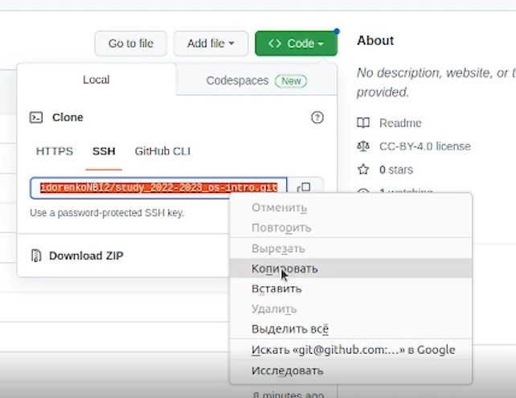

---
## Front matter
lang: ru-RU
title: Презентация лабораторной работы №2
author:
  - Сидоренко Максим Алексеевич
  - Группа НБИбд-02-22
institute:
  - Российский университет дружбы народов, Москва, Россия

## i18n babel
babel-lang: russian
babel-otherlangs: english

## Formatting pdf
toc: false
toc-title: Содержание
slide_level: 2
aspectratio: 169
section-titles: true
theme: metropolis
header-includes:
 - \metroset{progressbar=frametitle,sectionpage=progressbar,numbering=fraction}
 - '\makeatletter'
 - '\beamer@ignorenonframefalse'
 - '\makeatother'
---

# Цель работы 

## Цель работы

- Изучить идеологию и применение средств контроля версий.
- Освоить умения по работе с git.

# Задания

## Задания

- Создать базовую конфигурацию для работы с git.
- Создать ключ SSH.
- Создать ключ PGP.
- Настроить подписи git.
- Зарегистрироваться на Github.
- Создать локальный каталог для выполнения заданий по предмету.

# Создание базовой конфигурации для работы с git

- Создал базовую конфигурацию для работы с git

{#fig:001 width=70%}

## Создание базовой конфигурации для работы с git

{#fig:001 width=70%}

## Создание базовой конфигурации для работы с git

{#fig:001 width=70%}

## Создание базовой конфигурации для работы с git

{#fig:001 width=70%}

## Создание базовой конфигурации для работы с git

{#fig:001 width=70%}

## Создание ключа SSH.

- Создал ключ SSH.

{#fig:001 width=70%}

## Создание ключа SSH.

{#fig:001 width=70%}

## Создание ключей pgp

{#fig:001 width=70%}

## Создание ключей pgp

{#fig:001 width=70%}

## Создание ключей pgp

{#fig:001 width=70%}

## Настройка github

{#fig:001 width=70%}

## Настройка github

{#fig:001 width=70%}

## Добавление PGP ключа в GitHub

{#fig:001 width=70%}

## Добавление PGP ключа в GitHub

{#fig:001 width=70%}

## Добавление PGP ключа в GitHub

{#fig:001 width=70%}

## Настройка автоматических подписей коммитов git

{#fig:001 width=70%}

## Сознание репозитория курса на основе шаблона

{#fig:001 width=70%}

## Сознание репозитория курса на основе шаблона

{#fig:001 width=70%}

## Настройка каталога курса

{#fig:001 width=70%}

## Настройка каталога курса

{#fig:001 width=70%}

## Настройка каталога курса

{#fig:001 width=70%}

## Настройка каталога курса

{#fig:001 width=70%}

# Вывод

## Вывод

После проделанной данной работы я изучил идеологию и применение средств контроля версий.
Освоил умения по работе с git.

# Ответы на Контрольные вопросы

1) Система контроля версий (VCS) — это система, регистрирующая изменения в одном или
нескольких файлах с тем, чтобы в дальнейшем была возможность вернуться к
определённым старым версиям этих файлов. Для примеров в этой книге мы будем
использовать исходные коды программ, но на самом деле под версионный контроль
можно поместить файлы практически любого типа. Если вы графический или веб-
дизайнер и хотели бы хранить каждую версию изображения или макета — а этого вам
наверняка хочется — то пользоваться системой контроля версий будет очень мудрым
решением. даёт возможность возвращать отдельные файлы к прежнему виду, возвращать
к прежнему состоянию весь проект, просматривать происходящие со временем изменения,
определять, кто последним вносил изменения во внезапно переставший работать модуль,
кто и когда внёс в код какую-то ошибку, и многое другое. Вообще, если, пользуясь, вы всё
испортите или потеряете файлы, всё можно будет легко восстановить. Вдобавок,
накладные расходы за всё, что вы получаете, будут очень маленькими.

2) Хранилище-система, которая обеспечивает хранение всех существовавших вариантов
файлов Commit-фиксация изменений История-список предыдущих ревизий Рабочая
копия-копия другой ветки Команде commit можно передать сообщение, описывающее
изменения в ревизии. Она также записывает идентификатор пользователя, текущее время и временную 
зону, плюс список измененных файлов и их содержимого. Сообщение,
описывающее изменения, определяется через опцию -m, или – message. Можно также
вводить сообщения, состоящие из нескольких строк; в большинстве оболочек вы можете
сделать это оставив открытую кавычку в конце строки. commit -m "добавлен первый файл

3) Системы контроля версий. Централизованная система контроля версий Subversion и
децентрализованная система контроля версий Mercurial. Существуют СКВ
централизованные, в которых имеется один репозиторий, в который собираются
изменения со всех рабочих копий разработчиков, и децентрализованные, когда
репозиториев много, и они могут обмениваться изменениями между собой.
Централизованные СКВ - репозиторий один. У каждого разработчика своя рабочая копия.
Время от времени разработчик может затягивать к себе в рабочую копию новые
изменения из репозитория, или проталкивать свои изменения из своей рабочей копии в
репозиторий. Прочие особенности централизованных СКВ зависят от реализации. 
Децетрализованные не имееют определенный сервер и владельца

4) Традиционные системы управления версиями используют централизованную модель,
когда имеется единое хранилище документов, управляемое специальным сервером,
который и выполняет большую часть функций по управлению версиями. Пользователь,
работающий с документами, должен сначала получить нужную ему версию документа из
хранилища; обычно создаётся локальная копия документа, т. н. «рабочая копия». Может
быть получена последняя версия или любая из предыдущих, которая может быть выбрана
по номеру версии или дате создания, иногда и по другим признакам. После того, как в
документ внесены нужные изменения, новая версия помещается в хранилище. В отличие
от простого сохранения файла, предыдущая версия не стирается, а тоже остаётся в
хранилище и может быть оттуда получена в любое время. Сервер может использовать т. н.
дельта-компрессию — такой способ хранения документов, при котором сохраняются
только изменения между последовательными версиями, что позволяет уменьшить объём
хранимых данных. Поскольку обычно наиболее востребованной является последняя
версия файла, система может при сохранении новой версии сохранять её целиком, заменяя
в хранилище последнюю ранее сохранённую версию на разницу между этой и последней
версией. Некоторые системы (например, ClearCase) поддерживают сохранение версий
обоих видов: большинство версий сохраняется в виде дельт, но периодически (по
специальной команде администратора) выполняется сохранение версий всех файлов в
полном виде; такой подход обеспечивает максимально полное восстановление истории в
случае повреждения репозитория.

5) Традиционные системы управления версиями используют централизованную модель,
когда имеется единое хранилище документов, управляемое специальным сервером,
который и выполняет большую часть функций по управлению версиями. Пользователь,
работающий с документами, должен сначала получить нужную ему версию документа из
хранилища; обычно создаётся локальная копия документа, т. н. «рабочая копия». Может
быть получена последняя версия или любая из предыдущих, которая может быть выбрана
по номеру версии или дате создания, иногда и по другим признакам. После того, как в
документ внесены нужные изменения, новая версия помещается в хранилище. В отличие
от простого сохранения файла, предыдущая версия не стирается, а тоже остаётся в
хранилище и может быть оттуда получена в любое время. Сервер может использовать т. н.
дельт компрессию — такой способ хранения документов, при котором сохраняются
только изменения между последовательными версиями, что позволяет уменьшить объём
хранимых данных. Поскольку обычно наиболее востребованной является последняя
версия файла, система может при сохранении новой версии сохранять её целиком, заменяя
в хранилище последнюю ранее сохранённую версию на разницу между этой и последней версией. 
Некоторые системы (например, ClearCase) поддерживают сохранение версий
обоих видов: большинство версий сохраняется в виде дельт, но периодически (по
специальной команде администратора) выполняется сохранение версий всех файлов в
полном виде; такой подход обеспечивает максимально полное восстановление истории в
случае повреждения репозитория

6) Каковы основные задачи, решаемые инструментальным средством git?
Устанавливает единственную новую команду, git. Все возможности предоставляются
через подкоманды этой команды. Вы можете просмотреть краткую справку командой
help. Некоторые идеи группируются по темам, используйте help topics для списка
доступных тем. Одна из функций системы контроля версий — отслеживать кто сделал
изменения. В распределенных системах для этого требуется идентифицировать каждого
автора уникально в глобальном плане. Большинство людей уже имеют такой
идентификатор: email адрес. Bazaar достаточно умен, чтобы автоматически создавать
email адрес из текущего имени и адреса хоста.
Основные задачи: создание ветки, размещение веток, просмотр изменений, фиксация
изменений, сообщение из текстового редактора, выборочная фиксация, удаление
зафиксированных изменений, игнорирование файлов, просмотр истории, статистика
ветки, контроль файлов и каталогов, ветвление, объединение веток, публикация ветки

7) Обновление рабочей копии По мере внесения изменений в проект рабочая копия на
компьютере разработчика стареет, расхождение её с основной версией проекта
увеличивается. Это повышает риск возникновения конфликтных изменений (см. ниже).
Поэтому удобно поддерживать рабочую копию в состоянии, максимально близком к
текущей основной версией, для чего разработчик выполняет операцию обновления
рабочей копии (update) насколько возможно часто (реальная частота обновлений
определяется частотой внесения изменений, зависящей от активности разработки и числа
разработчиков, а также временем, затрачиваемым на каждое обновление — если оно
велико, разработчик вынужден ограничичать частоту обновлений, чтобы не терять время).
Модификация проекта Разработчик модифицирует проект, изменяя вхо дящие в него
файлы в рабочей копии в соответствии с проектным заданием. Эта работа производится
локально и не требует обращений к серверу VCS. Фиксация изменений Завершив
очередной этап работы над заданием,разработчик фиксирует (commit) свои изменения,
передавая их на сервер (либо в основную ветвь, если работа над заданием полностью
завершена, либо в отдельную ветвь разработки данного задания). VCS может требовать от
разработчика перед фиксацией обязательно выполнить обновление рабочей копии. При
наличии в системе поддержки отложенных изменений (shelving) изменения могут быть
переданы на сервер без фиксации. Если утверждённая политика работы в VCS это
позволяет, то фиксация изменений может проводиться не ежедневно, а только по
завершении работы над заданием; в этом случае до завершения работы все связанные с
заданием изменения сохраняются только в локальной рабочей копии разработчика.

8) Мы создаем новую ветку выполнив git init в уже созданном каталоге: % mkdir tutorial % cd
tutorial % ls -a ./ ../ % pwd /home/mbp/work/bzr.test/tutorial % % git init % ls -
aF ./ ../ .git/ %
Мы обычно обращаемся к веткам на нашем компьютере просто передав имя каталога
содержащего ветку. bzr также поддерживает доступ к веткам через http и sftp, например:
git log http://bazaar-vcs.org git // git.dev/ git log sftp://bazaarvcs.org/bzr/bzr.dev/ 
Установив
для git плагины можно также осуществлять доступ к веткам с использованием rsync.
Команда status показывает какие изменения были сделаны в рабочем каталоге с момента
последней ревизии: % git status modified: foo bzr status скрывает неинтересные файлы,
которые либо не менялись, либо игнорируются. Также команде status могут быть
переданы необязательные имена файлов, или каталогов для проверки. Команда diff

9) показывает изменения в тексте файлов в стандартном формате diff. Вывод этой команды
может быть передан другим командам, таким как ”patch”, ”diffstat”, ”filterdiff” и
”colordiff”: % git diff === added file ’hello.txt’ --- hello.txt 1970-01-01 00:00:00 +0000 +++
hello.txt 2005-10-18 14:23:29 +00006.2. Указания к лабораторной работе 75 @@ -0,0 +1,1
@@ +hello world Команде commit можно передать сообщение описывающее изменения в
ревизии. Она также записывает идентификатор пользователя, текущее время и временную
зону, плюс список измененных файлов и их содержимого. git commit -m "добавлен первый
файл" Если вы передадите список имен файлов, или каталогов после команды commit, то
будут зафиксированы только изменения для переданных объектов. Например: bzr commit -
m "исправления документации" commit.py Если вы сделали какие-либо изменения и не
хотите оставлять их, используйте команду revert, что бы вернутся к состоянию
предыдущей ревизии. Многие деревья с исходным кодом содержат файлы которые не
нужно хранить под контролем версий, например резервные файлы текстового редактора,
объектные файлы и собранные программы. Вы можете просто не добавлять их, но они
всегда будут обнаруживаться как неизвестные. Вы также можете сказать git игнорировать
их добавив их в файл .ignore в корне рабочего дерева. Для получения списка файлов
которые игнорируются и соответствующих им шаблонов используйте команду ignored: %
ignored config.h ./config.h configure.in~ *~ log Команда bzr log показывает список
предыдущих ревизий. Команда log --forward делает тоже самое, но в хронологическом
порядке, показывая более поздние ревизии в конце может контролировать файлы и
каталоги, отслеживая переименования и упрощая их последующее объединение: % mkdir
src % echo ’int main() {}’ > src/simple.c % add src added src added src/simple.c % status 
added:
src/ src/simple.c bzr remove удаляет файл из под контроля версий, но может и не удалять
рабочую копию файла2. Это удобно, когда вы добавили не тот файл, или решили, что
файл на самом деле не должен быть под контролем версий. % rm -r src % remove -v
hello.txt ? hello.txt % status removed: hello.txt src/ src/simple.c unknown: hello.txt Часто
вместо того что бы начинать свой собственный проект, выхотите предложить изменения
для уже готового проекта. Что бы сделать это вам нужно получить копию готовой ветки.
Так как эта копия может быть потенциальной новой веткой.Если две ветки разошлись (обе
имеют уникальные изменения) тогда merge — это подходящая команда для
использования. Объединение автоматически вычислит изменения, которые существуют на
объединяемой ветке и отсутствуют в локальной ветке и попытается объединить их с
локальной веткой. git merge URL.

9) Часто вместо того что бы начинать свой собственный проект, вы хотите предложить
изменения для уже готового проекта. Что бы сделать это вам нужно получить копию
готовой ветки. Так как эта копия может быть потенциальной новой веткой эта команда
называется branch: Управление версиями git branch cd git.dev Эта команда копирует
полную историю ветки и после этого вы можете делать все операции с ней локально:
просматривать журнал, создавать и объединять другие ветки.

10) Нет проблем если шаблон для игнорирования подходит для файла под контролем версий,
или вы добавили файл, который игнорируется. Шаблоны не имеют никакого эффекта на
файлы под контролем версий, они только определяют показываются неизвестные файлы,
или просто игнорируются. Файл git.rignore обычно должен быть под контролем версий,
что бы новые копии ветки видели такие же шаблоны: git add . gitignore git commit -m
"Добавлены шаблоны для игнорирования". Многие деревья с исходным кодом содержат
файлы, которые не нужно хранить под контролем версий, например, резервные файлы
текстового редактора, объектные файлы и собранные программы. Вы можете просто не
добавлять их, но они всегда будут обнаруживаться как неизвестные. Вы также можете
сказать bzr игнорировать их добавив их в файл в корне рабочего дерева. Этот файл
содержит список шаблонов файлов, по одному в каждой строчке. Обычное содержимое
может быть таким: *.o *~ *.tmp *.py [ co ] Если шаблон содержит слеш, то он будет
сопоставлен с полным путем начиная от корня рабочего дерева; иначе он сопоставляется
только с именем файла. Таким образом пример выше игнорирует файлы с расширением .o
во всех подкаталогах, но пример ниже игнорирует только config.h в корне рабочего дерева
и HTML файлы в каталоге doc/: ./config.h doc/*.html Для получения списка файлов
которые игнорируются и соответствующих им шаблонов используйте команду git ignored
: $ git ignored config.h ./config.h configure.in~ *~ $

:::

