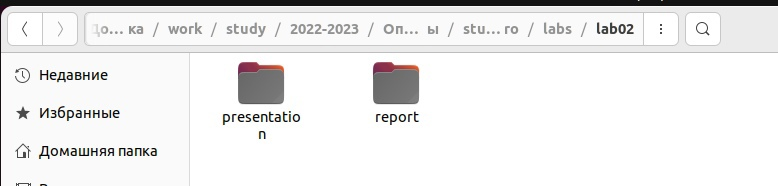
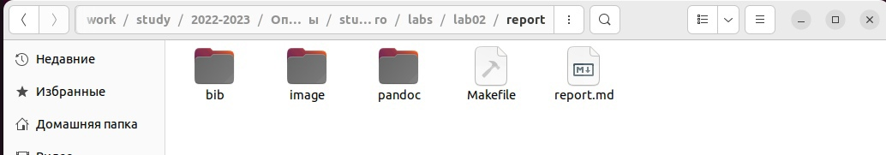
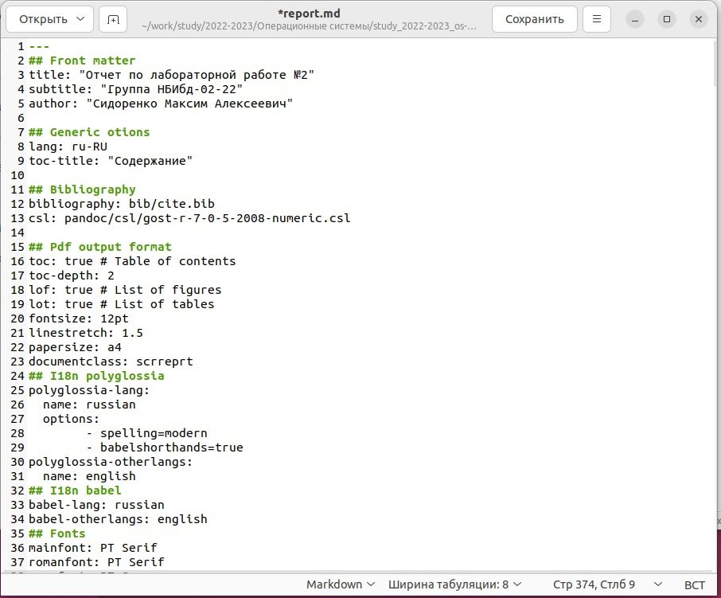
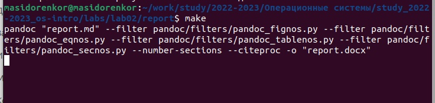
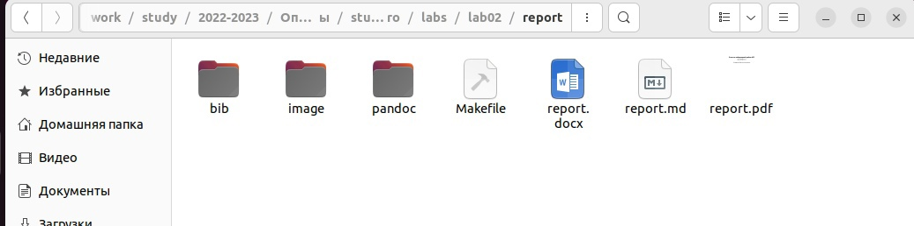
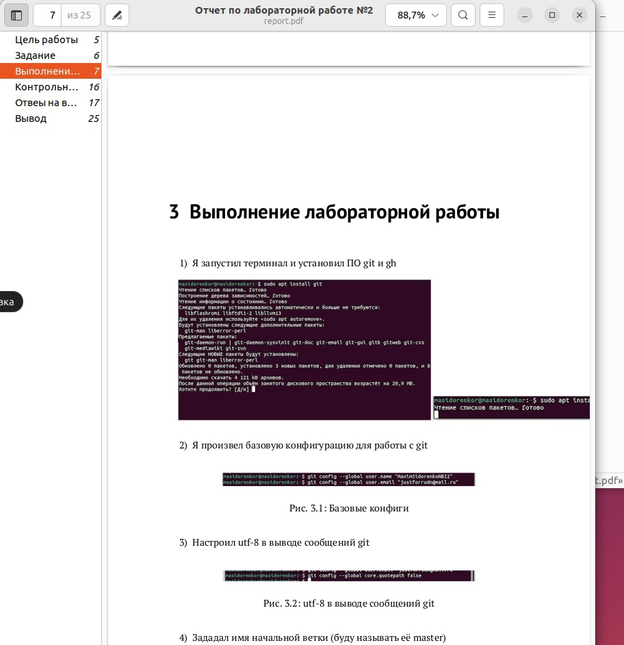
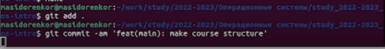
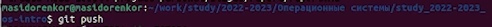
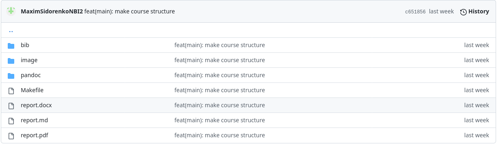

---
## Front matter
lang: ru-RU
title: Презентация лабораторной работы №3
author:
  - Сидоренко Максим Алексеевич
  - Группа НБИбд-02-22
institute:
  - Российский университет дружбы народов, Москва, Россия

## i18n babel
babel-lang: russian
babel-otherlangs: english

## Formatting pdf
toc: false
toc-title: Содержание
slide_level: 2
aspectratio: 169
section-titles: true
theme: metropolis
header-includes:
 - \metroset{progressbar=frametitle,sectionpage=progressbar,numbering=fraction}
 - '\makeatletter'
 - '\beamer@ignorenonframefalse'
 - '\makeatother'
---

# Цель работы 

## Цель работы

- Целью работы является - научиться оформлять отчёты с помощью легковесного языка разметки Markdown.

# Задания

## Задания

- Сделать отчёт по предыдущей лабораторной работе в формате Markdown.
В качестве отчёта предоставить отчёты в 3 форматах: pdf, docx и md (в архиве,
поскольку он должен содержать скриншоты, Makefile и т.д.)

# Создание отчета в Markdown

## Создание отчета в Markdown

{#fig:001 width=70%}

## Создание отчета в Markdown

- Перешёл в каталог report

{#fig:001 width=70%}

## Создание отчета в Markdown

- Открыл файл report.md, начал редактировать данный текстовый файл

{#fig:001 width=70%}

## Создание отчета в Markdown

После проделанной работы, открыл терминал, перешл в каталог курса, написал строку make, она создаст из файла report.md - файлы report.docx и report.pdf

{#fig:001 width=70%}

## Создание отчета в Markdown

Я перешёл к каталог курса, после прописанной строки, проверил, что все файлы создались

{#fig:001 width=70%}

## Создание отчета в Markdown

Я запустил файл report.pdf, проверил корректность созданного файла

{#fig:001 width=70%}

# Выгрузка файлов в репозиторий GitHub

## Выгрузка файлов в репозиторий GitHub

После сделанного, я открыл терминал и выгрузил файлы на Github, в свой репозиторий

{#fig:001 width=70%}

## Выгрузка файлов в репозиторий GitHub

{#fig:001 width=70%}

## Выгрузка файлов в репозиторий GitHub

{#fig:001 width=70%}

# Вывод

- После проделанной работы, я научился оформлять отчёты с помощью легковесного языка разметки Markdown.

:::

