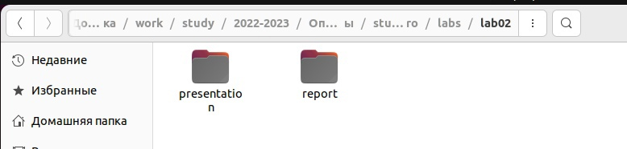
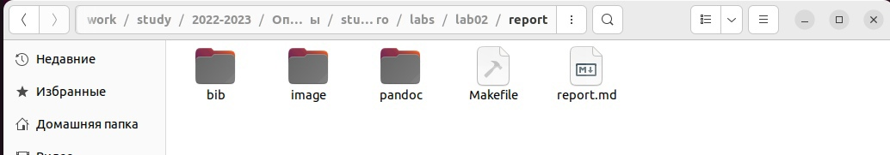
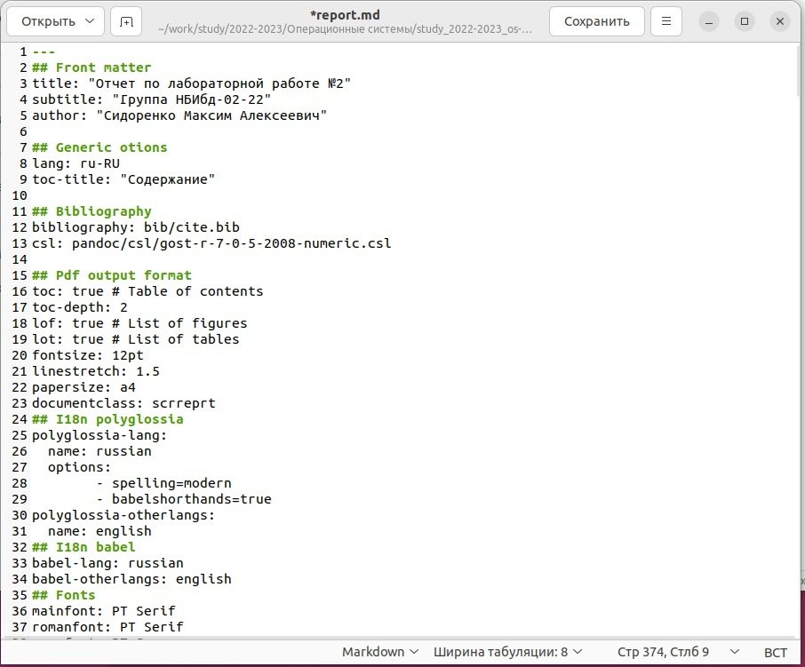
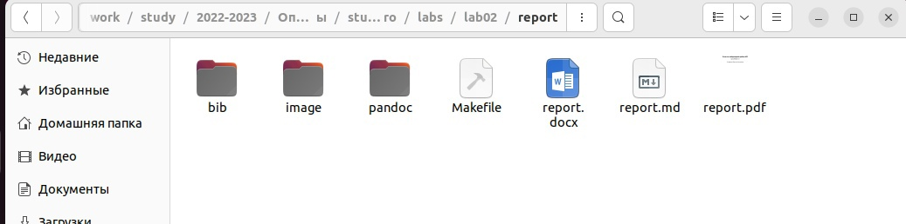
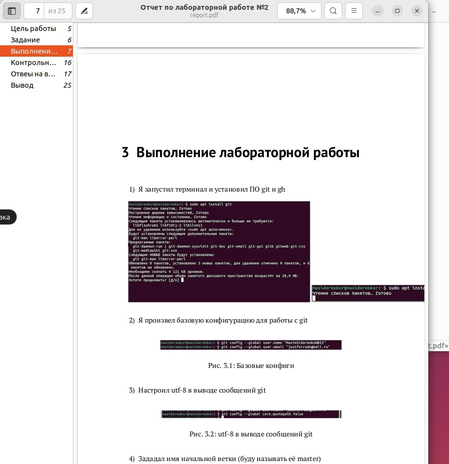
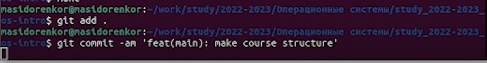
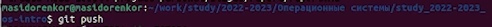
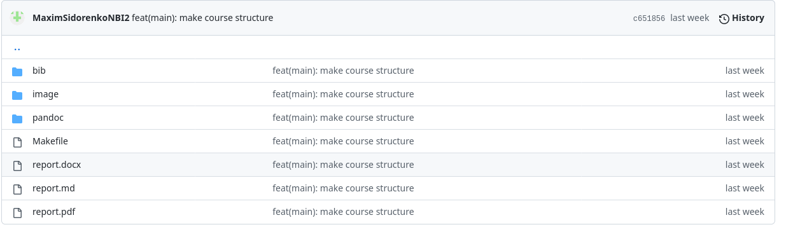

---
## Front matter
title: "Отчет по лабораторной работе №3"
subtitle: "Группа НБИбд-02-22"
author: "Сидоренко Максим Алексеевич"

## Generic otions
lang: ru-RU
toc-title: "Содержание"

## Bibliography
bibliography: bib/cite.bib
csl: pandoc/csl/gost-r-7-0-5-2008-numeric.csl

## Pdf output format
toc: true # Table of contents
toc-depth: 2
lof: true # List of figures
lot: true # List of tables
fontsize: 12pt
linestretch: 1.5
papersize: a4
documentclass: scrreprt
## I18n polyglossia
polyglossia-lang:
  name: russian
  options:
	- spelling=modern
	- babelshorthands=true
polyglossia-otherlangs:
  name: english
## I18n babel
babel-lang: russian
babel-otherlangs: english
## Fonts
mainfont: PT Serif
romanfont: PT Serif
sansfont: PT Sans
monofont: PT Mono
mainfontoptions: Ligatures=TeX
romanfontoptions: Ligatures=TeX
sansfontoptions: Ligatures=TeX,Scale=MatchLowercase
monofontoptions: Scale=MatchLowercase,Scale=0.9
## Biblatex
biblatex: true
biblio-style: "gost-numeric"
biblatexoptions:
  - parentracker=true
  - backend=biber
  - hyperref=auto
  - language=auto
  - autolang=other*
  - citestyle=gost-numeric
## Pandoc-crossref LaTeX customization
figureTitle: "Рис."
tableTitle: "Таблица"
listingTitle: "Листинг"
lofTitle: "Список иллюстраций"
lolTitle: "Листинги"
## Misc options
indent: true
header-includes:
  - \usepackage{indentfirst}
  - \usepackage{float} # keep figures where there are in the text
  - \floatplacement{figure}{H} # keep figures where there are in the text
---

# Цель работы

Научиться оформлять отчёты с помощью легковесного языка разметки Markdown.

# Задание

1. Сделать отчёт по предыдущей лабораторной работе в формате Markdown.
2. В качестве отчёта предоставить отчёты в 3 форматах: pdf, docx и md (в архиве,
поскольку он должен содержать скриншоты, Makefile и т.д.)

# Выполнение лабораторной работы

1) Я перешел в каталог с шаблоном отчета лабораторной работы номер 2

{#fig:001 width=70%}

2) Перешёл в каталог report

{#fig:001 width=70%}

3) Открыл файл report.md, начал редактировать данный текстовый файл

{#fig:001 width=70%}

4) После проделанной работы, открыл терминал, перешл в каталог курса, написал строку make, она создаст из файла report.md - файлы report.docx и report.pdf

{#fig:001 width=70%}

5) Я перешёл к каталог курса, после прописанной строки, проверил, что все файлы создались
 
{#fig:001 width=70%}

6) Я запустил файл report.pdf, проверил корректность созданного файла

{#fig:001 width=70%}

7) После сделанного, я открыл терминал и выгрузил файлы на Github, в свой репозиторий

{#fig:001 width=70%}

{#fig:001 width=70%}

8) Я перешёл в свой репозиторий на GitHub для проверки того, что все файлы создались

{#fig:001 width=70%}

# Вывод

После проделанной работы, я научился оформлять отчёты с помощью легковесного языка разметки Markdown.

::: {#refs}
:::
