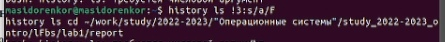

---
## Front matter
lang: ru-RU
title: Презентация лабораторной работы №4
author:
  - Сидоренко Максим Алексеевич
  - Группа НБИбд-02-22
institute:
  - Российский университет дружбы народов, Москва, Россия

## i18n babel
babel-lang: russian
babel-otherlangs: english

## Formatting pdf
toc: false
toc-title: Содержание
slide_level: 2
aspectratio: 169
section-titles: true
theme: metropolis
header-includes:
 - \metroset{progressbar=frametitle,sectionpage=progressbar,numbering=fraction}
 - '\makeatletter'
 - '\beamer@ignorenonframefalse'
 - '\makeatother'
---

# Цель работы 

## Цель работы

- Приобретение практических навыков взаимодействия пользователя с системой по-
средством командной строки.

# Задания

## Задания

- При помощи основы интерфейса взаимодействия
пользователя с системой Unix на уровне командной строки

# Определение полнго имени 
## Определение полнго имени 

{#fig:001 width=70%}

## Просмотр файлов

{#fig:001 width=70%}

## Просмотр файлов

- Открыл файл report.md, начал редактировать данный текстовый файл

{#fig:001 width=70%}

## Просмотр файлов

{#fig:001 width=70%}

## Просмотр файлов

Я перешёл к каталог курса, после прописанной строки, проверил, что все файлы создались

{#fig:001 width=70%}

## Создание файлов и их удаление

{#fig:001 width=70%}

## Создание файлов и их удаление

{#fig:001 width=70%}

## Создание файлов и их удаление

{#fig:001 width=70%}

## Создание файлов и их удаление

{#fig:001 width=70%}

## Создание файлов и их удаление

{#fig:001 width=70%}

## Информация о командах

После сделанного, я открыл терминал и выгрузил файлы на Github, в свой репозиторий

{#fig:001 width=70%}

## Информация о командах

{#fig:001 width=70%}

## Информация о командах

{#fig:001 width=70%}

## Информация о командах

{#fig:001 width=70%}

## Информация о командах

{#fig:001 width=70%}

## Информация о командах

{#fig:001 width=70%}

## Информация о командах

{#fig:001 width=70%}

## Информация о командах

{#fig:001 width=70%}

## Информация о командах

{#fig:001 width=70%}

## Информация о командах

{#fig:001 width=70%}

## Информация о командах

{#fig:001 width=70%}

## History и её модификация

{#fig:001 width=70%}

## History и её модификация

{#fig:001 width=70%}

## History и её модификация

{#fig:001 width=70%}

## History и её модификация

{#fig:001 width=70%}

# Ответы на контрольные вопросы

1. Интерфейс командной строки — способ взаимодействия между человеком и компьютером путём отправки компьютеру команд, представляющих собой последовательность символов. Команды интерпретируются с помощью специального интерпретатора, называемого оболочкой.

2. Оболочка вашей системы Linux, Bash, по умолчанию показывает только название текущего каталога, а на весь путь. Это говорит вам, что вы находитесь в каталоге /newuser, расположенном в вашем каталоге /home. Команда pwd расшифровывается как "print working directory" (просмотр текущего каталога).

3. При помощи команды ls

4. Самый простой способо показать скрытые файлы в Linux - это использовать команды ls с опцией -a, что значит all

5. rmdir -r, rm -r, нет нельзя, первая для пустых каталогов, вторая для всего

6. При помощи History и её модификаций 

7. После History дописать опции

8. Создание нескольких файлов, переход и создание и тд

9. Экранирование символов — замена в тексте управляющих символов на соответствующие текстовые подстановки. Один из видов управляющих последовательностей.

10. Вывести список файлов по одному на строку

11. Относительный путь — это путь к файлу относительно текущего каталога. Текущий каталог — это тот, в котором запускается скрипт, программа или открывается страница в браузере. Первая точка означает текущий каталог, вторая — на уровень выше, а косая черта — что нам нужно зайти в тот каталог и взять оттуда файл data.

12. man и название команды

13. TAB 
Клавиша TAB — самая частая и основная в использовании среди всех горячих клавиш Linux. Данная клавиша поможет вам дополнить команду или путь к файлу или предложит варианты, если их несколько.
Для использования данного функционала начните набирать команду и нажмите TAB после введения нескольких символов.
Одно нажатие — дополняет команду.
Два нажатия — предлагает несколько вариантов, если введенный текст имеет несколько вариантов продолжения. Например, двойное нажатие Tab поможет написать длинный путь к нужному файлу или директории.

# Вывод

- После проделанной работы, я приобрел практические навыки взаимодействия пользователя с системой по-средством командной строки.

:::

