---
## Front matter
title: "Отчет по лабораторной работе №4"
subtitle: "Группа НБИбд-02-22"
author: "Сидоренко Максим Алексеевич"

## Generic otions
lang: ru-RU
toc-title: "Содержание"

## Bibliography
bibliography: bib/cite.bib
csl: pandoc/csl/gost-r-7-0-5-2008-numeric.csl

## Pdf output format
toc: true # Table of contents
toc-depth: 2
lof: true # List of figures
lot: true # List of tables
fontsize: 12pt
linestretch: 1.5
papersize: a4
documentclass: scrreprt
## I18n polyglossia
polyglossia-lang:
  name: russian
  options:
	- spelling=modern
	- babelshorthands=true
polyglossia-otherlangs:
  name: english
## I18n babel
babel-lang: russian
babel-otherlangs: english
## Fonts
mainfont: PT Serif
romanfont: PT Serif
sansfont: PT Sans
monofont: PT Mono
mainfontoptions: Ligatures=TeX
romanfontoptions: Ligatures=TeX
sansfontoptions: Ligatures=TeX,Scale=MatchLowercase
monofontoptions: Scale=MatchLowercase,Scale=0.9
## Biblatex
biblatex: true
biblio-style: "gost-numeric"
biblatexoptions:
  - parentracker=true
  - backend=biber
  - hyperref=auto
  - language=auto
  - autolang=other*
  - citestyle=gost-numeric
## Pandoc-crossref LaTeX customization
figureTitle: "Рис."
tableTitle: "Таблица"
listingTitle: "Листинг"
lofTitle: "Список иллюстраций"
lolTitle: "Листинги"
## Misc options
indent: true
header-includes:
  - \usepackage{indentfirst}
  - \usepackage{float} # keep figures where there are in the text
  - \floatplacement{figure}{H} # keep figures where there are in the text
---

# Цель работы

Приобретение практических навыков взаимодействия пользователя с системой по-
средством командной строки.

# Задание

1. Определите полное имя вашего домашнего каталога. Далее относительно этого ката-
лога будут выполняться последующие упражнения.
2. Выполните следующие действия:
 2.1. Перейдите в каталог /tmp.
 2.2. Выведите на экран содержимое каталога /tmp. Для этого используйте команду ls
 с различными опциями. Поясните разницу в выводимой на экран информации.
 2.3. Определите, есть ли в каталоге /var/spool подкаталог с именем cron?
 2.4. Перейдите в Ваш домашний каталог и выведите на экран его содержимое. Опре-
делите, кто является владельцем файлов и подкаталогов?
3. Выполните следующие действия:
 3.1. В домашнем каталоге создайте новый каталог с именем newdir.
 3.2. В каталоге ~/newdir создайте новый каталог с именем morefun.
 3.3. В домашнем каталоге создайте одной командой три новых каталога с именами
 letters, memos, misk. Затем удалите эти каталоги одной командой.
 3.4. Попробуйте удалить ранее созданный каталог ~/newdir командой rm. Проверьте,
 был ли каталог удалён.
 3.5. Удалите каталог ~/newdir/morefun из домашнего каталога. Проверьте, был ли
 каталог удалён.
4. С помощью команды man определите, какую опцию команды ls нужно использо-
вать для просмотра содержимое не только указанного каталога, но и подкаталогов,
входящих в него.
5. С помощью команды man определите набор опций команды ls, позволяющий отсорти-
ровать по времени последнего изменения выводимый список содержимого каталога
с развёрнутым описанием файлов.
6. Используйте команду man для просмотра описания следующих команд: cd, pwd, mkdir,
rmdir, rm. Поясните основные опции этих команд.
7. Используя информацию, полученную при помощи команды history, выполните мо-
дификацию и исполнение нескольких команд из буфера команд.
# Выполнение лабораторной работы

1) Я определил полное имя домашнего каталога

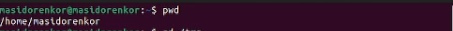{#fig:001 width=70%}

2) Перешёл в каталог tmp

{#fig:001 width=70%}

3) Вывел содержимое каталога tmp, если написать после ls название каталога, то бдует выводиться содержимое этого каталога

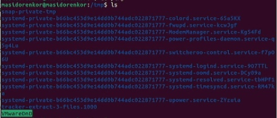{#fig:001 width=70%}

4) В каталоге /var/spool я узнал, что имеется подкаталог с именем cron

{#fig:001 width=70%}

5) Я перешёл в домашний каталог и вывел содержимое, владельцем является мой аккаунт от линукса
 
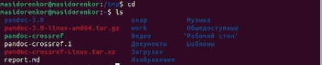{#fig:001 width=70%}

6) В домашнем каталоге я создал каталог newdir

{#fig:001 width=70%}

7) Я перешёл в каталог newdir и создал там подкаталог morefun

{#fig:001 width=70%}

8) Я создал одной командой каталоги letters, memos, misk, затем удалил их одной командой 

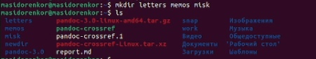{#fig:001 width=70%}

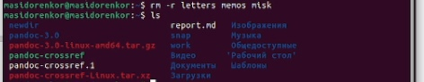{#fig:001 width=70%}

9) Далее я удалил каталог newdir

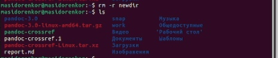{#fig:001 width=70%}

10) С помощью команды man,  я вывел все опции и информацию о команде ls -al

{#fig:001 width=70%}

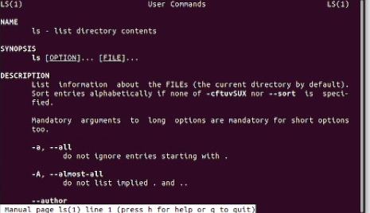{#fig:001 width=70%}

11) С помощью man, я вывел информацию o: cd, pwd, mkdir, rmdir, rm

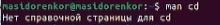{#fig:001 width=70%}

{#fig:001 width=70%}

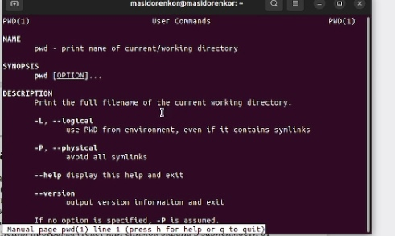{#fig:001 width=70%}

{#fig:001 width=70%}

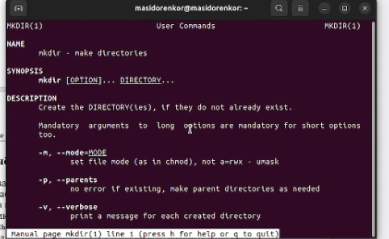{#fig:001 width=70%}

{#fig:001 width=70%}

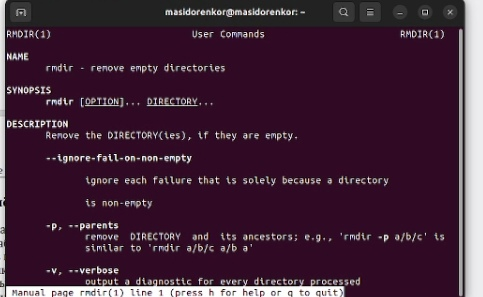{#fig:001 width=70%}

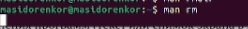{#fig:001 width=70%}

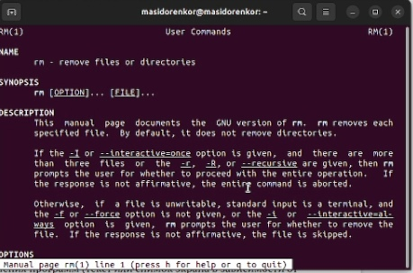{#fig:001 width=70%}

12) При помощи команды history, я посмотрел все команды, которые я вводил за все время

{#fig:001 width=70%}

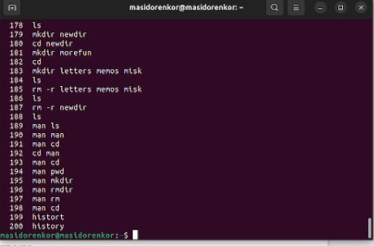{#fig:001 width=70%}

13) Я произвел модификацию команды history

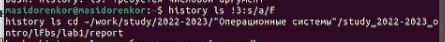{#fig:001 width=70%}

# Контрольные вопросы

1. Что такое командная строка?
2. При помощи какой команды можно определить абсолютный путь текущего каталога?
Приведите пример.
3. При помощи какой команды и каких опций можно определить только тип файлов
и их имена в текущем каталоге? Приведите примеры.
4. Каким образом отобразить информацию о скрытых файлах? Приведите примеры.
5. При помощи каких команд можно удалить файл и каталог? Можно ли это сделать
одной и той же командой? Приведите примеры.
6. Каким образом можно вывести информацию о последних выполненных пользовате-
лем командах? работы?
7. Как воспользоваться историей команд для их модифицированного выполнения? При-
ведите примеры.
8. Приведите примеры запуска нескольких команд в одной строке.
9. Дайте определение и приведите примера символов экранирования.
10. Охарактеризуйте вывод информации на экран после выполнения команды ls с опцией
l.
11. Что такое относительный путь к файлу? Приведите примеры использования относи-
тельного и абсолютного пути при выполнении какой-либо команды.
12. Как получить информацию об интересующей вас команде?
13. Какая клавиша или комбинация клавиш служит для автоматического дополнения
вводимых команд?

# Ответы на контрольные вопросы

1. Интерфейс командной строки — способ взаимодействия между человеком и компьютером путём отправки компьютеру команд, представляющих собой последовательность символов. Команды интерпретируются с помощью специального интерпретатора, называемого оболочкой.

2. Оболочка вашей системы Linux, Bash, по умолчанию показывает только название текущего каталога, а на весь путь. Это говорит вам, что вы находитесь в каталоге /newuser, расположенном в вашем каталоге /home. Команда pwd расшифровывается как "print working directory" (просмотр текущего каталога).

3. При помощи команды ls

4. Самый простой способо показать скрытые файлы в Linux - это использовать команды ls с опцией -a, что значит all

5. rmdir -r, rm -r, нет нельзя, первая для пустых каталогов, вторая для всего

6. При помощи History и её модификаций 

7. После History дописать опции

8. Создание нескольких файлов, переход и создание и тд

9. Экранирование символов — замена в тексте управляющих символов на соответствующие текстовые подстановки. Один из видов управляющих последовательностей.

10. Вывести список файлов по одному на строку

11. Относительный путь — это путь к файлу относительно текущего каталога. Текущий каталог — это тот, в котором запускается скрипт, программа или открывается страница в браузере. Первая точка означает текущий каталог, вторая — на уровень выше, а косая черта — что нам нужно зайти в тот каталог и взять оттуда файл data.

12. man и название команды

13. TAB 
Клавиша TAB — самая частая и основная в использовании среди всех горячих клавиш Linux. Данная клавиша поможет вам дополнить команду или путь к файлу или предложит варианты, если их несколько.
Для использования данного функционала начните набирать команду и нажмите TAB после введения нескольких символов.
Одно нажатие — дополняет команду.
Два нажатия — предлагает несколько вариантов, если введенный текст имеет несколько вариантов продолжения. Например, двойное нажатие Tab поможет написать длинный путь к нужному файлу или директории.

# Вывод

После проделанной работы, я приобрел практические навыки взаимодействия пользователя с системой по-средством командной строки.

::: {#refs}
:::
