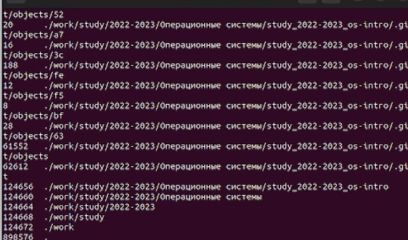

---
## Front matter
lang: ru-RU
title: Презентация лабораторной работы №6
author:
  - Сидоренко Максим Алексеевич
  - Группа НБИбд-02-22
institute:
  - Российский университет дружбы народов, Москва, Россия

## i18n babel
babel-lang: russian
babel-otherlangs: english

## Formatting pdf
toc: false
toc-title: Содержание
slide_level: 2
aspectratio: 169
section-titles: true
theme: metropolis
header-includes:
 - \metroset{progressbar=frametitle,sectionpage=progressbar,numbering=fraction}
 - '\makeatletter'
 - '\beamer@ignorenonframefalse'
 - '\makeatother'
---

# Цель работы 

## Цель работы

- Ознакомление с инструментами поиска файлов и фильтрации текстовых данных.
Приобретение практических навыков: по управлению процессами (и заданиями), по
проверке использования диска и обслуживанию файловых систем.
# Задания

## Задания

- Поиск файлов. Перенаправление
ввода-вывода. Просмотр запущенных процессов

# Запись  в файл и 
## Определение полнго имени  и дописование, вывод

{#fig:001 width=70%}

## Вывод файлов с одинаковым именем

{#fig:001 width=70%}

## Вывод файлов с одинаковым именем

{#fig:001 width=70%}

## Вывод фалов с первой буквой c 

{#fig:001 width=70%}

## Вывод фалов с первой буквой c 

{#fig:001 width=70%}

## Вывод фалов с первой буквой h

{#fig:001 width=70%}

## Запуск и удаление фонового процесса

{#fig:001 width=70%}

## Запуск и удаление фонового процесса

{#fig:001 width=70%}

## Запуск фонового процесса gedit

{#fig:001 width=70%}

## Определение идентификатор процесса gedit

{#fig:001 width=70%}

## Информация о kill и завершение с помощью этой команды

{#fig:001 width=70%}

## Информация о kill и завершение с помощью этой команды

{#fig:001 width=70%}

## Ввод команд df и du и информация о них

{#fig:001 width=70%}

## Ввод команд df и du и информация о них

{#fig:001 width=70%}

## Ввод команд df и du и информация о них

{#fig:001 width=70%}

## Ввод команд df и du и информация о них

{#fig:001 width=70%}

## Ввод команд df и du и информация о них

{#fig:001 width=70%}

## Ввод команд df и du и информация о них

{#fig:001 width=70%}

## Ввод команд df и du и информация о них

{#fig:001 width=70%}

## Ввод команд find и информация о ней

{#fig:001 width=70%}

## Ввод команд find и информация о ней

{#fig:001 width=70%}

## Ввод команд find и информация о ней

{#fig:001 width=70%}

## Ввод команд find и информация о ней

{#fig:001 width=70%}

# Ответы на контрольные вопросы

1.  stdin — стандартный ввод (клавиатура),
    stdout — стандартный вывод (экран),
    stderr — стандартная ошибка (вывод ошибок на экран).

2. > : Перезаписывает существующий файл или создает файл, если файл с указанным именем отсутствует в каталоге.
>> : добавляет существующий файл или создает файл, если файл с указанным именем отсутствует в каталоге.

3. Конвейер в терминологии операционных систем семейства Unix — некоторое множество процессов, для которых выполнено следующее перенаправление ввода-вывода: то, что выводит на поток стандартного вывода предыдущий процесс, попадает в поток стандартного ввода следующего процесса.

4. Процесс — это система действий, реализующая определенную функцию в вычислительной системе и оформленная так, что управляющая программа вычислительной системы может перераспределять ресурсы этой системы в целях обеспечения многозадачности.
Программа - это набор строк, это просто приложение 

5. Идентификатор процесса (англ. Process IDentifier, PID) — уникальный номер (идентификатор) процесса в многозадачной операционной системе (ОС).
Идентификатор группы (GID). Кроме идентификационного номера пользователя с учётной записью связан идентификатор группы. Группы пользователей применяются для организации доступа нескольких пользователей к некоторым ресурсам. У группы, так же, как и у пользователя, есть имя и идентификационный номер — GID (Group ID).

6. Зада́ча — проблемная ситуация с явно заданной целью, которую необходимо достичь; в более узком смысле задачей также называют саму эту цель, данную в рамках проблемной ситуации, то есть то, что требуется сделать.

ps — список запущенных процессов на компьютере
kill — отправка сигнала одному или нескольким процессам (обычно «убийство» процесса)
jobs — просмотр списка собственных задач (процессов)
bg — выполнение процесса в фоновом режиме
fg — возврат процесса из фонового режима

7. top - интерактивный просмотрщик процессов. htop аналог top.
Программа top динамически выводит в режиме реального времени информации о работающей системе, т.е. о фактической активности процессов. По умолчанию она выдает задачи, наиболее загружающие процессор сервера, и обновляет список каждые две секунды. 
Htop – основанный на ncurses просмотрщик процессов подобный top, htop, atop определение загрузки ОС (Load average, LA), но позволяющий прокручивать список процессов вертикально и горизонтально, чтобы видеть их полные параметры запуска. Управление процессами (остановка, изменение приоритета) может выполняться без ручного ввода их идентификаторов. 

8. Для поиска файлов из командной строки вы можете использовать команду “find”. Пример показан в 12 задании лаборатной работы

9. Дабы найти файл по его содержимому во всех Linux — подобных ОС, достаточно использовать утилиту find. пишешь find и следующие синтаксисы связанные с содержимым 

10. Вести строку df

11. Вести строку du

12. kill

# Вывод

- После ознакомления с инструментами поиска файлов и фильтрации текстовых данных.
Я приобрел практические навыки: по управлению процессами (и заданиями), по
проверке использования диска и обслуживанию файловых систем.

:::

