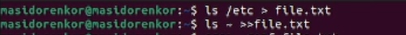
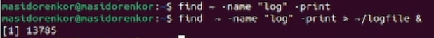
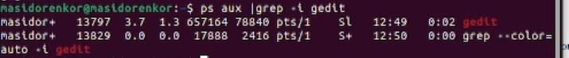
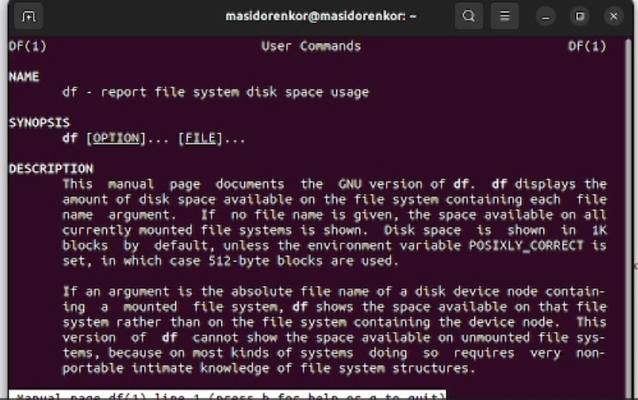
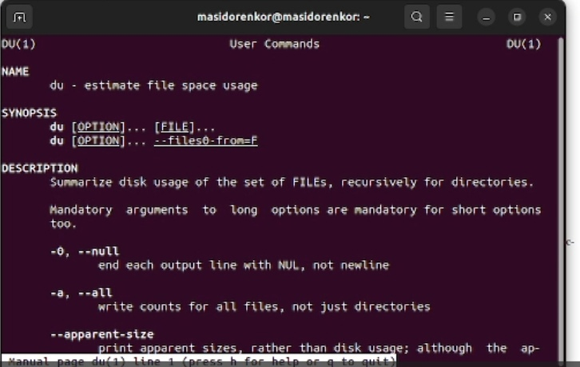
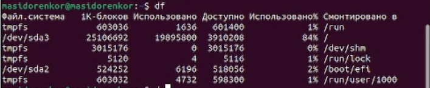
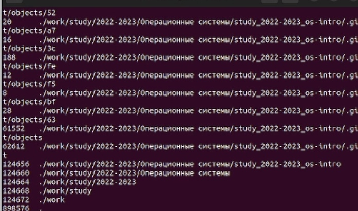
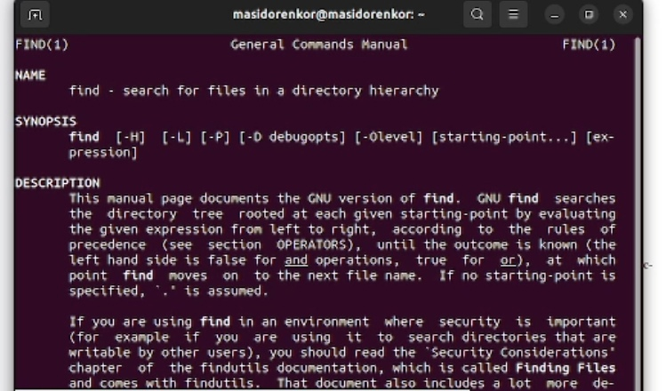
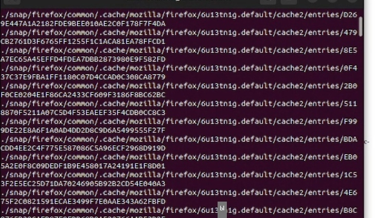

---
## Front matter
title: "Отчет по лабораторной работе №6"
subtitle: "Группа НБИбд-02-22"
author: "Сидоренко Максим Алексеевич"

## Generic otions
lang: ru-RU
toc-title: "Содержание"

## Bibliography
bibliography: bib/cite.bib
csl: pandoc/csl/gost-r-7-0-5-2008-numeric.csl

## Pdf output format
toc: true # Table of contents
toc-depth: 2
lof: true # List of figures
lot: true # List of tables
fontsize: 12pt
linestretch: 1.5
papersize: a4
documentclass: scrreprt
## I18n polyglossia
polyglossia-lang:
  name: russian
  options:
	- spelling=modern
	- babelshorthands=true
polyglossia-otherlangs:
  name: english
## I18n babel
babel-lang: russian
babel-otherlangs: english
## Fonts
mainfont: PT Serif
romanfont: PT Serif
sansfont: PT Sans
monofont: PT Mono
mainfontoptions: Ligatures=TeX
romanfontoptions: Ligatures=TeX
sansfontoptions: Ligatures=TeX,Scale=MatchLowercase
monofontoptions: Scale=MatchLowercase,Scale=0.9
## Biblatex
biblatex: true
biblio-style: "gost-numeric"
biblatexoptions:
  - parentracker=true
  - backend=biber
  - hyperref=auto
  - language=auto
  - autolang=other*
  - citestyle=gost-numeric
## Pandoc-crossref LaTeX customization
figureTitle: "Рис."
tableTitle: "Таблица"
listingTitle: "Листинг"
lofTitle: "Список иллюстраций"
lolTitle: "Листинги"
## Misc options
indent: true
header-includes:
  - \usepackage{indentfirst}
  - \usepackage{float} # keep figures where there are in the text
  - \floatplacement{figure}{H} # keep figures where there are in the text
---

# Цель работы

Ознакомление с инструментами поиска файлов и фильтрации текстовых данных.
Приобретение практических навыков: по управлению процессами (и заданиями), по
проверке использования диска и обслуживанию файловых систем.

# Задание

1. Осуществите вход в систему, используя соответствующее имя пользователя.
2. Запишите в файл file.txt названия файлов, содержащихся в каталоге /etc. Допи-
шите в этот же файл названия файлов, содержащихся в вашем домашнем каталоге.
3. Выведите имена всех файлов из file.txt, имеющих расширение .conf, после чего
запишите их в новый текстовой файл conf.txt.
4. Определите, какие файлы в вашем домашнем каталоге имеют имена, начинавшиеся
с символа c? Предложите несколько вариантов, как это сделать.
5. Выведите на экран (по странично) имена файлов из каталога /etc, начинающиеся
с символа h.
6. Запустите в фоновом режиме процесс, который будет записывать в файл ~/logfile
файлы, имена которых начинаются с log.
7. Удалите файл ~/logfile.
8. Запустите из консоли в фоновом режиме редактор gedit.
9. Определите идентификатор процесса gedit, используя команду ps, конвейер и фильтр
grep. Как ещё можно определить идентификатор процесса?
10. Прочтите справку (man) команды kill, после чего используйте её для завершения
процесса gedit.
11. Выполните команды df и du, предварительно получив более подробную информацию
об этих командах, с помощью команды man.
12. Воспользовавшись справкой команды find, выведите имена всех директорий, имею-
щихся в вашем домашнем каталоге.
# Выполнение лабораторной работы

1) Я Осуществил вход в систему, используя соответствующее имя пользователя, (оно заходит автоматически)

2) Записал в файл file.txt названия файлов, содержащихся в каталоге /etc. Дописал в этот же файл названия файлов, содержащихся в моем домашнем каталоге.

{#fig:001 width=70%}

3) Вывел имена всех файлов из file.txt, имеющих расширение .conf, после чего
записал их в новый текстовой файл conf.txt.

{#fig:001 width=70%}

{#fig:001 width=70%}

4) Определил, какие файлы в вашем домашнем каталоге имеют имена, начинавшиеся
с символа c? Предложил несколько вариантов, как это сделать.

{#fig:001 width=70%}

{#fig:001 width=70%}

5) Вывел на экран (по странично) имена файлов из каталога /etc, начинающиеся
с символа h.
 
{#fig:001 width=70%}

6) Запустил в фоновом режиме процесс, который будет записывать в файл ~/logfile
файлы, имена которых начинаются с log.

{#fig:001 width=70%}

7) Я удалил файл ~/logfile.

{#fig:001 width=70%}

8) Я запустил из консоли в фоновом режиме редактор gedit.

{#fig:001 width=70%}

9) Определил идентификатор процесса gedit, используя команду ps, конвейер и фильтр
grep. 

{#fig:001 width=70%}

10) Прочёл справку (man) команды kill, после чего использовал её для завершения
процесса gedit.

{#fig:001 width=70%}

{#fig:001 width=70%}

11) Выполнил команды df и du, предварительно получив более подробную информацию
об этих командах, с помощью команды man.

{#fig:001 width=70%}

{#fig:001 width=70%}

{#fig:001 width=70%}

{#fig:001 width=70%}

{#fig:001 width=70%}

{#fig:001 width=70%}

{#fig:001 width=70%}

12) Воспользовавшись справкой команды find, я вывел имена всех директорий, имею-
щихся в моем домашнем каталоге.

{#fig:001 width=70%}

{#fig:001 width=70%}

{#fig:001 width=70%}

{#fig:001 width=70%}

# Контрольные вопросы

1. Какие потоки ввода вывода вы знаете?
2. Объясните разницу между операцией > и >>.
3. Что такое конвейер?
4. Что такое процесс? Чем это понятие отличается от программы?
5. Что такое PID и GID?
6. Что такое задачи и какая команда позволяет ими управлять?
7. Найдите информацию об утилитах top и htop. Каковы их функции?
8. Назовите и дайте характеристику команде поиска файлов. Приведите примеры ис-
пользования этой команды.
9. Можно ли по контексту (содержанию) найти файл? Если да, то как?
10. Как определить объем свободной памяти на жёстком диске?
11. Как определить объем вашего домашнего каталога?
12. Как удалить зависший процесс?

# Ответы на контрольные вопросы

1.  stdin — стандартный ввод (клавиатура),
    stdout — стандартный вывод (экран),
    stderr — стандартная ошибка (вывод ошибок на экран).

2. > : Перезаписывает существующий файл или создает файл, если файл с указанным именем отсутствует в каталоге.
>> : добавляет существующий файл или создает файл, если файл с указанным именем отсутствует в каталоге.

3. Конвейер в терминологии операционных систем семейства Unix — некоторое множество процессов, для которых выполнено следующее перенаправление ввода-вывода: то, что выводит на поток стандартного вывода предыдущий процесс, попадает в поток стандартного ввода следующего процесса.

4. Процесс — это система действий, реализующая определенную функцию в вычислительной системе и оформленная так, что управляющая программа вычислительной системы может перераспределять ресурсы этой системы в целях обеспечения многозадачности.
Программа - это набор строк, это просто приложение 

5. Идентификатор процесса (англ. Process IDentifier, PID) — уникальный номер (идентификатор) процесса в многозадачной операционной системе (ОС).
Идентификатор группы (GID). Кроме идентификационного номера пользователя с учётной записью связан идентификатор группы. Группы пользователей применяются для организации доступа нескольких пользователей к некоторым ресурсам. У группы, так же, как и у пользователя, есть имя и идентификационный номер — GID (Group ID).

6. Зада́ча — проблемная ситуация с явно заданной целью, которую необходимо достичь; в более узком смысле задачей также называют саму эту цель, данную в рамках проблемной ситуации, то есть то, что требуется сделать.

ps — список запущенных процессов на компьютере
kill — отправка сигнала одному или нескольким процессам (обычно «убийство» процесса)
jobs — просмотр списка собственных задач (процессов)
bg — выполнение процесса в фоновом режиме
fg — возврат процесса из фонового режима

7. top - интерактивный просмотрщик процессов. htop аналог top.
Программа top динамически выводит в режиме реального времени информации о работающей системе, т.е. о фактической активности процессов. По умолчанию она выдает задачи, наиболее загружающие процессор сервера, и обновляет список каждые две секунды. 
Htop – основанный на ncurses просмотрщик процессов подобный top, htop, atop определение загрузки ОС (Load average, LA), но позволяющий прокручивать список процессов вертикально и горизонтально, чтобы видеть их полные параметры запуска. Управление процессами (остановка, изменение приоритета) может выполняться без ручного ввода их идентификаторов. 

8. Для поиска файлов из командной строки вы можете использовать команду “find”. Пример показан в 12 задании лаборатной работы

9. Дабы найти файл по его содержимому во всех Linux — подобных ОС, достаточно использовать утилиту find. пишешь find и следующие синтаксисы связанные с содержимым 

10. Вести строку df

11. Вести строку du

12. kill

# Вывод

После ознакомления с инструментами поиска файлов и фильтрации текстовых данных.
Я приобрел практические навыки: по управлению процессами (и заданиями), по
проверке использования диска и обслуживанию файловых систем.

::: {#refs}
:::
