---
## Front matter
lang: ru-RU
title: "Лабораторная работа No 8"
subtitle: "Текстовой редактор vi"
author:
  - Павлов Арсений Валерьевич
institute:
  - Российский университет дружбы народов, Москва, Россия
 
date: 28 марта 2023

## i18n babel
babel-lang: russian
babel-otherlangs: english

## Formatting pdf
toc: false
toc-title: Содержание
slide_level: 2
aspectratio: 43
section-titles: true
theme: metropolis
header-includes:
 - \metroset{progressbar=frametitle,sectionpage=progressbar,numbering=fraction}
 - '\makeatletter'
 - '\beamer@ignorenonframefalse'
 - '\makeatother'
---

## Выполнение лабораторной работы

## Цель работы

Познакомиться с операционной системой Linux. Получить практические навыки рабо-
ты с редактором vi, установленным по умолчанию практически во всех дистрибутивах.

##

1. Создаю каталог с именем ~/work/os/lab06 и перехожу во вновь созданный каталог.

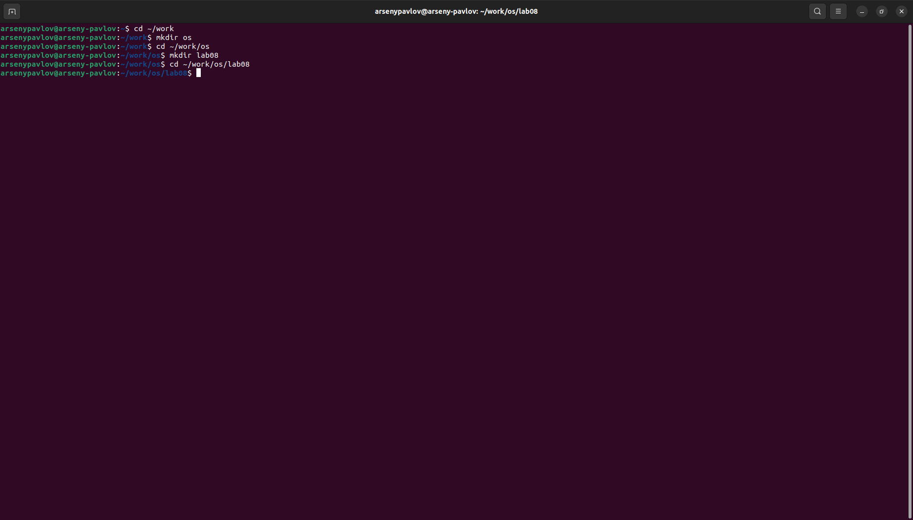

##

2. Вызываю vi и создаю файл hello.sh

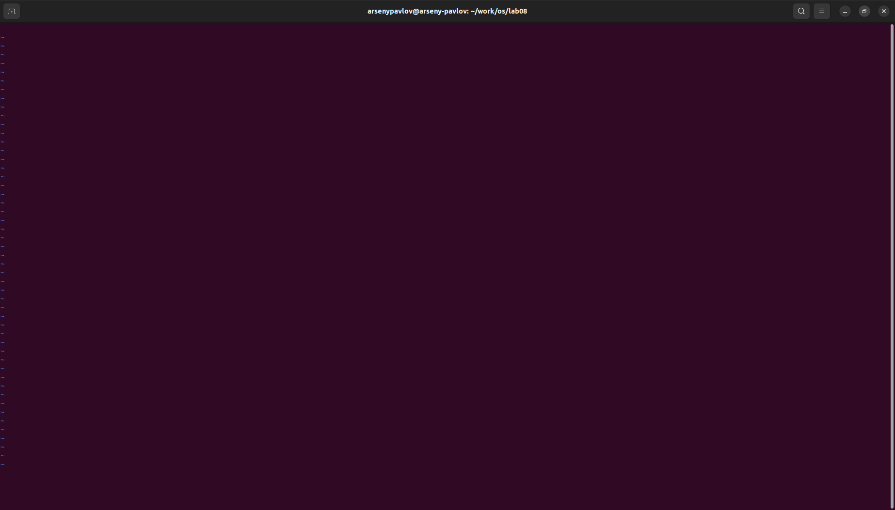

##

3. Нажимаю клавишу i и ввожу следующий текст.
#!/bin/bash

HELL=Hello

function hello {
	LOCAL HELLO=World
	echo $HELLO	
}

echo $HELLO

hello

##

4. Нажимаю клавишу Esc для перехода в командный режим после завершения ввода
текста, а также нажимаю : для перехода в режим последней строки и внизу вашего экрана появится
приглашение в виде двоеточия.

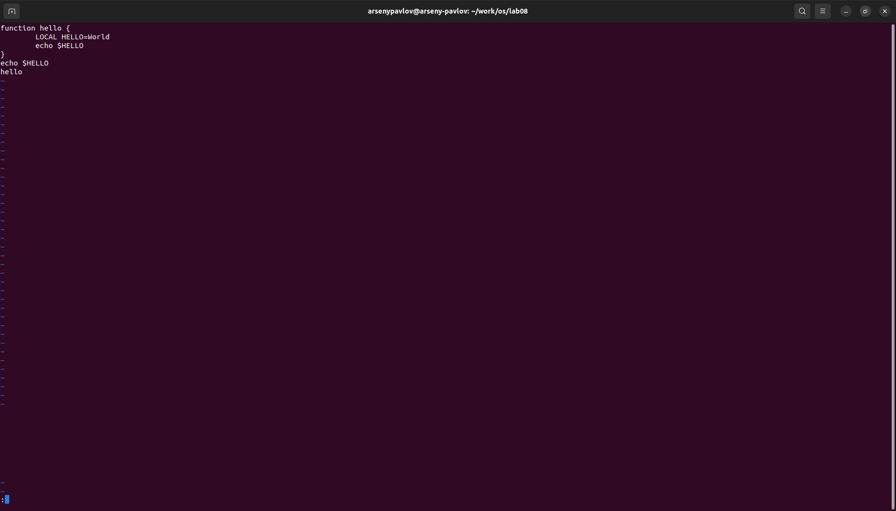

##

5. Нажимаю w (записать) и q (выйти), а затем нажмите клавишу Enter для сохранения
вашего текста и завершения работы.

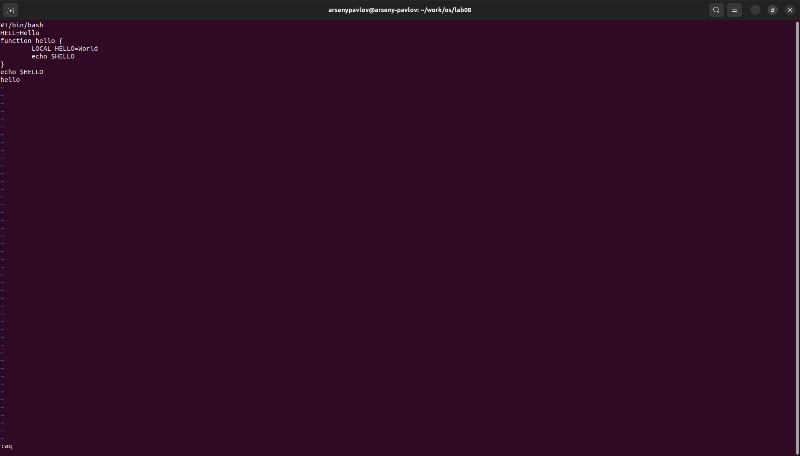

##

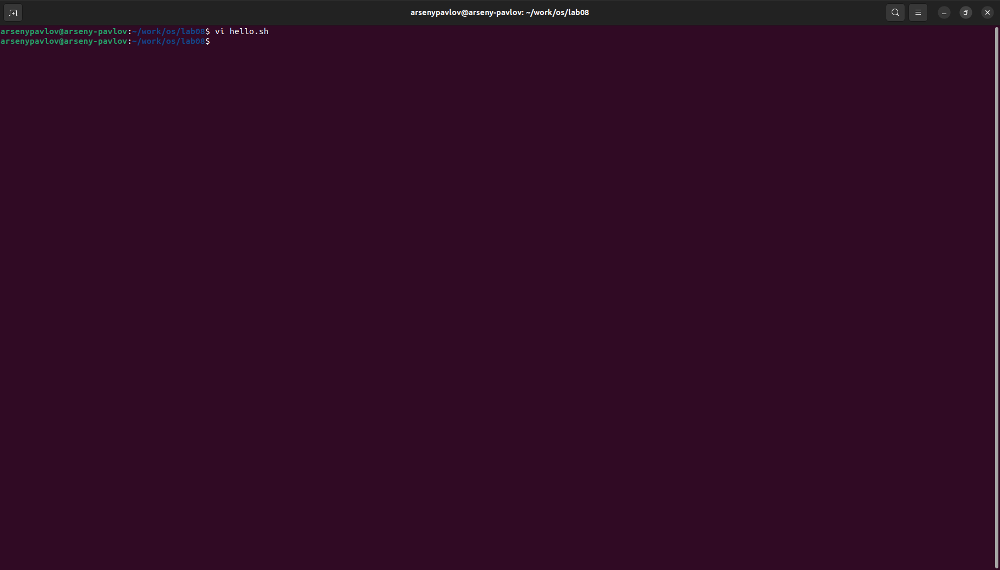

##

6. Делаю файл исполняемым, путем ввода команды
	chmod +x hello.sh

##
	
Выполнение задания номер 2.
1. Вызываю vi на редактирование файла
	vi ~/work/os/lab08/hello.sh

##

2. Устанавливаю курсор в конец слова HELL второй строки и перехожу в режим вставки и заменяю на HELLO.

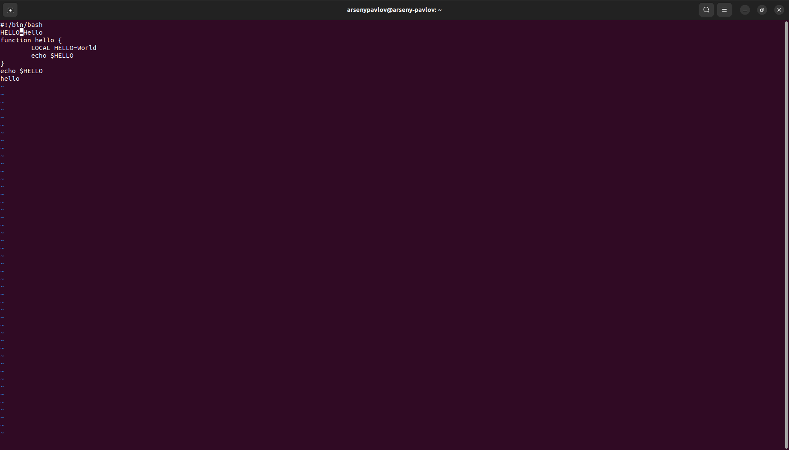
##

4. Установливаю курсор на четвертую строку и стираю слово LOCAL.

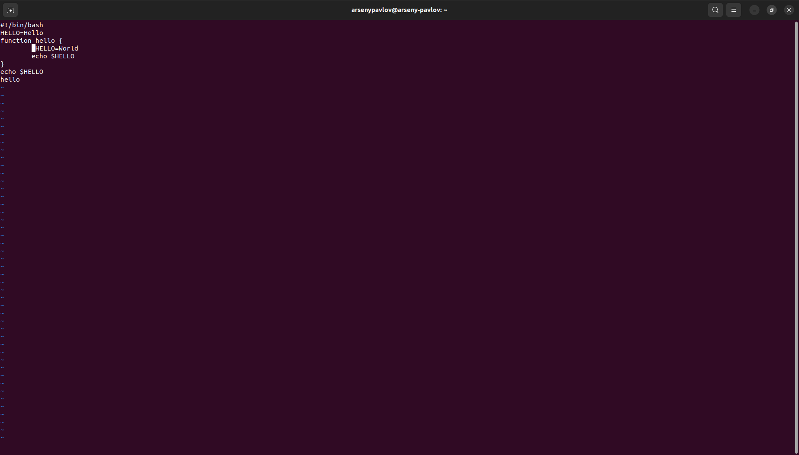

##

5. Перехожу в режим вставки и набираю следующий текст: local, нажимаю Esc для
возврата в командный режим.

##

6. Устанавливаю курсор на последней строке файла. Вставляю после неё строку, содержащую
следующий текст: echo $HELLO.

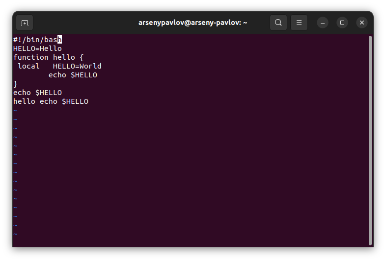
##

7. Нажимаю Esc для перехода в командный режим и удаляю последнюю строку.

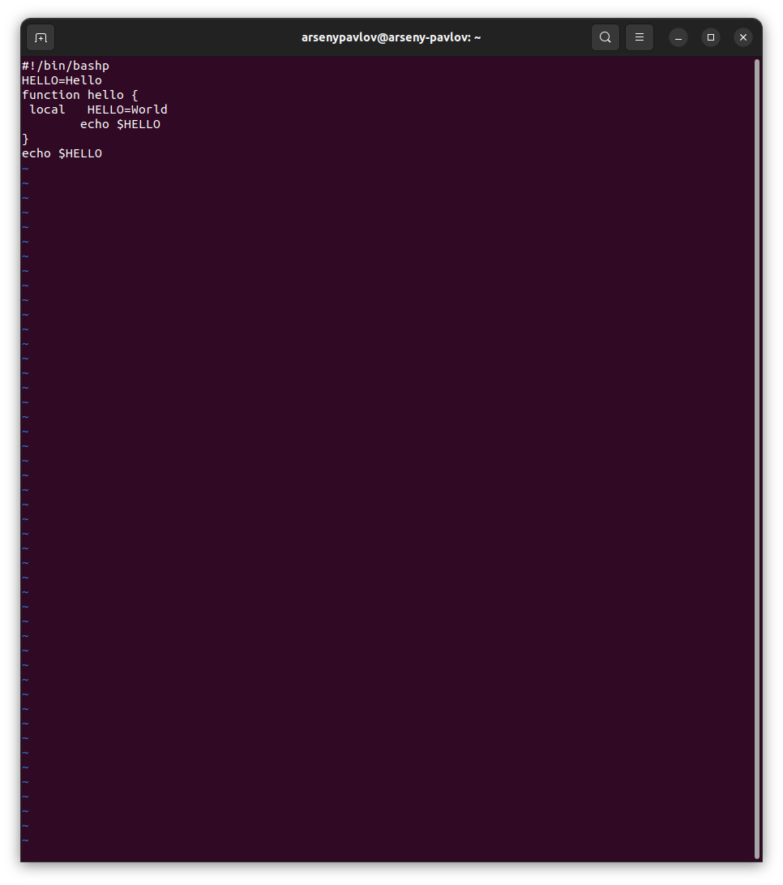

8. Ввожу команду отмены изменений u для отмены последней команды.

##

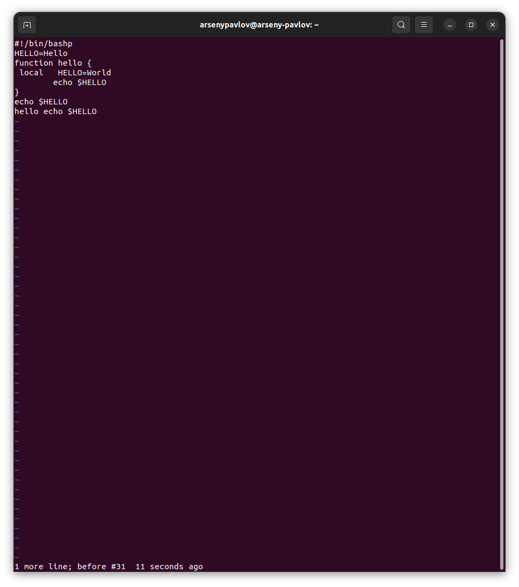
##

9. Ввожу символ : для перехода в режим последней строки. Записываю произведённые
изменения и выхожу из vi.

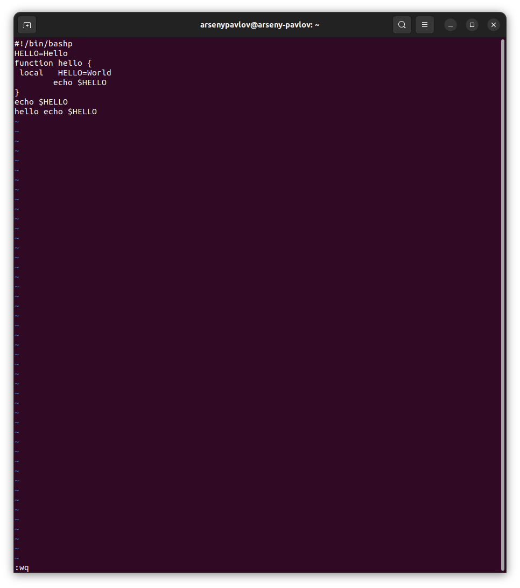

## Вывод

Я познакомился с операционной системой Linux, получил практические навыки рабо-
ты с редактором vi, установленным по умолчанию практически во всех дистрибутивах.

## Список литературы

https://esystem.rudn.ru/pluginfile.php/1975909/mod_resource/content/4/008-lab_vi.pdf

:::

