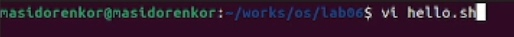
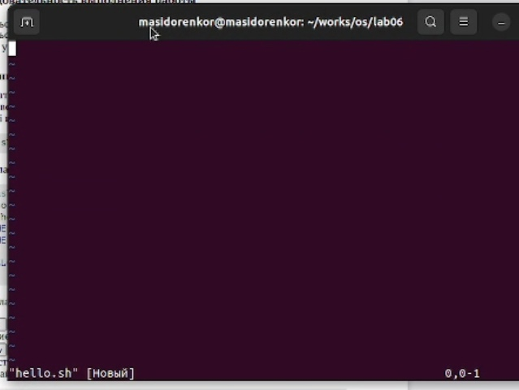
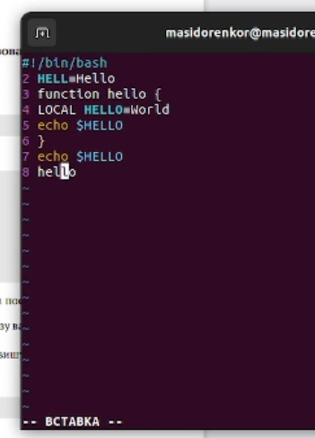
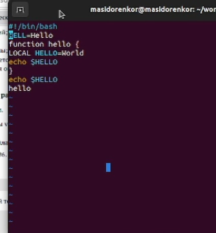
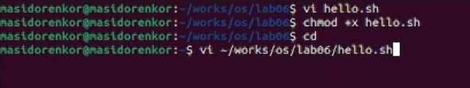
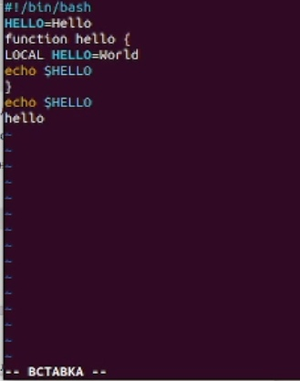
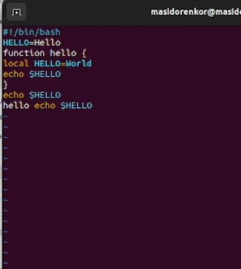
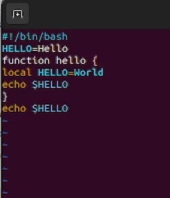
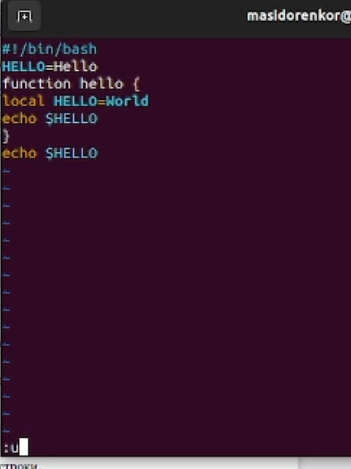
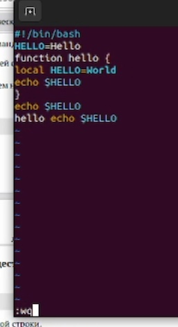

---
## Front matter
lang: ru-RU
title: Презентация лабораторной работы №8
author:
  - Сидоренко Максим Алексеевич
  - Группа НБИбд-02-22
institute:
  - Российский университет дружбы народов, Москва, Россия

## i18n babel
babel-lang: russian
babel-otherlangs: english

## Formatting pdf
toc: false
toc-title: Содержание
slide_level: 2
aspectratio: 169
section-titles: true
theme: metropolis
header-includes:
 - \metroset{progressbar=frametitle,sectionpage=progressbar,numbering=fraction}
 - '\makeatletter'
 - '\beamer@ignorenonframefalse'
 - '\makeatother'
---

# Цель работы 

## Цель работы

- Познакомиться с операционной системой Linux. Получить практические навыки рабо-
ты с редактором vi, установленным по умолчанию практически во всех дистрибутивах.

# Задания

## Задания

- Создание нового файла с использованием vi, Редактирование существующего файла

# Создание нового файла с использованием vi
## Создание нового файла с использованием vi

{#fig:001 width=70%}

## Создание нового файла с использованием vi

{#fig:001 width=70%}

## Создание нового файла с использованием vi

{#fig:001 width=70%}

## Создание нового файла с использованием vi

{#fig:001 width=70%}

## Создание нового файла с использованием vi 

{#fig:001 width=70%}

## Создание нового файла с использованием vi

{#fig:001 width=70%}

## Создание нового файла с использованием vi

{#fig:001 width=70%}

## Создание нового файла с использованием vi

{#fig:001 width=70%}

# Редактирование существующего файла
## Редактирование существующего файла

{#fig:001 width=70%}

## Редактирование существующего файла

{#fig:001 width=70%}

## Редактирование существующего файла

{#fig:001 width=70%}

## Редактирование существующего файла

{#fig:001 width=70%}

## Редактирование существующего файла

{#fig:001 width=70%}

## Редактирование существующего файла

{#fig:001 width=70%}

## Редактирование существующего файла

{#fig:001 width=70%}

## Редактирование существующего файла

{#fig:001 width=70%}

# Ответы на контрольные вопросы

1. Краткая характеристика режимов работы редактора vi: – командный режим — предназначен для ввода команд редактирования и навигации по
редактируемому файлу; – режим вставки — предназначен для ввода содержания редактируемого файла; – режим последней (или командной) строки
— используется для записи изменений в файл и выхода из редактора.
2. Выйти из редактора, не сохраняя произведённые изменения, можно используя клавиши «:q!» в командном режиме.
3. Краткую характеристика команд позиционирования: – 0 (ноль) — переход в
начало строки; – $ — переход в конец строки; – G — переход в конец файла;
– n G — переход на строку с номером n.
4. Для редактора vi словом является: пробел; буквы, находящиеся между двумя
пробелами.
5. Из любого места редактируемого файла перейти в конец файла можно с
помощью клавишы G и курсора вниз, а в начало – курсор вверх.
6. Краткая характеристика основных групп команд редактирования: Вставка
текста – а — вставить текст после курсора; – А — вставить текст в конец
строки; – i — вставить текст перед курсором; – n i — вставить текст n раз; –
I — вставить текст в начало строки. Вставка строки – о — вставить строку
под курсором; – О — вставить строку над курсором. Удаление текста – x —
удалить один символ в буфер; – d w — удалить одно слово в буфер; – d $ — удалить в буфер текст от курсора до конца строки; – d 0 — удалить в буфер
текст от начала строки до позиции курсора; – d d — удалить в буфер одну
строку; – n d d — удалить в буфер n строк. Отмена и повтор произведённых
изменений – u — отменить последнее изменение; –.— повторить последнее
изменение. Копирование текста в буфер – Y — скопировать строку в буфер;
– n Y — скопировать n строк в буфер; – y w — скопировать слово в буфер.
Вставка текста из буфера – p — вставить текст из буфера после курсора; – P
— вставить текст из буфера перед курсором. Замена текста – c w — заменить
слово; – n c w — заменить n слов; – c $ — заменить текст от курсора до конца
строки; – r — заменить слово; – R — заменить текст. Поиск текста – / текст
— произвести поиск вперёд по тексту указанной строки символов текст; –
? текст — произвести поиск назад по тексту указанной строки символов
текст.
7. Чтобы заполнить строку символами $ можно использовать клавиши ni(вставить текст n раз).
8. Отменить некорректное действие, связанное с процессом редактирования,
можно с помощью клавиши «.».
9. Характеристика основных групп команд режима последней строки: Копирование и перемещение текста – : n,m d — удалить строки с n по m; – : i,j m
k — переместить строки с i по j, начиная со строки k; – : i,j t k — копировать
строки с i по j в строку k; – : i,j w имя-файла — записать строки с i по j в файл
с именем имя-файла. Запись в файл и выход из редактора – : w — записать
изменённый текст в файл, не выходя из vi; – : w имя-файла — записать
изменённый текст в новый файл с именем имяфайла; – : w ! имя-файла —
записать изменённый текст в файл с именем имяфайла; – : w q — записать
изменения в файл и выйти из vi; – : q — выйти из редактора vi; – : q ! —
выйти из редактора без записи; – : e ! — вернуться в командный режим,
отменив все изменения, произведённые со времени последней записи.10. Определить, не перемещая курсора, позицию, в которой заканчивается
строка, можно используя клавишу $ (переход в конец строки).
11. Опции редактора vi позволяют настроить рабочую среду. Для задания опций используется команда set (в режиме последней строки): – : set all —
вывести полный список опций; – : set nu — вывести номера строк; – : set
list — вывести невидимые символы; – : set ic — не учитывать при поиске,
является ли символ прописным или строчным. Если вы хотите отказаться от
использования опции,то в команде set перед именем опции надо поставить
no.
12. Определить режим работы редактора vi можно по последней командной
строке.
13. Взаимосвязь режимов работы редактора vi: «Командный режим» - «Режим
вставки» / «Режим командной строки»

# Вывод

- После проделанной, я познакомился с операционной системой Linux. Получил практические навыки работы с редактором vi, установленным по умолчанию практически во всех дистрибутивах.

:::

