---
## Front matter
title: "Отчет по лабораторной работе №8"
subtitle: "Группа НБИбд-02-22"
author: "Сидоренко Максим Алексеевич"

## Generic otions
lang: ru-RU
toc-title: "Содержание"

## Bibliography
bibliography: bib/cite.bib
csl: pandoc/csl/gost-r-7-0-5-2008-numeric.csl

## Pdf output format
toc: true # Table of contents
toc-depth: 2
lof: true # List of figures
lot: true # List of tables
fontsize: 12pt
linestretch: 1.5
papersize: a4
documentclass: scrreprt
## I18n polyglossia
polyglossia-lang:
  name: russian
  options:
	- spelling=modern
	- babelshorthands=true
polyglossia-otherlangs:
  name: english
## I18n babel
babel-lang: russian
babel-otherlangs: english
## Fonts
mainfont: PT Serif
romanfont: PT Serif
sansfont: PT Sans
monofont: PT Mono
mainfontoptions: Ligatures=TeX
romanfontoptions: Ligatures=TeX
sansfontoptions: Ligatures=TeX,Scale=MatchLowercase
monofontoptions: Scale=MatchLowercase,Scale=0.9
## Biblatex
biblatex: true
biblio-style: "gost-numeric"
biblatexoptions:
  - parentracker=true
  - backend=biber
  - hyperref=auto
  - language=auto
  - autolang=other*
  - citestyle=gost-numeric
## Pandoc-crossref LaTeX customization
figureTitle: "Рис."
tableTitle: "Таблица"
listingTitle: "Листинг"
lofTitle: "Список иллюстраций"
lolTitle: "Листинги"
## Misc options
indent: true
header-includes:
  - \usepackage{indentfirst}
  - \usepackage{float} # keep figures where there are in the text
  - \floatplacement{figure}{H} # keep figures where there are in the text
---

# Цель работы

Познакомиться с операционной системой Linux. Получить практические навыки рабо-
ты с редактором vi, установленным по умолчанию практически во всех дистрибутивах.

# Указание к работе

В большинстве дистрибутивов Linux в качестве текстового редактора по умолчанию
устанавливается интерактивный экранный редактор vi (Visual display editor).
Редактор vi имеет три режима работы:
– командный режим — предназначен для ввода команд редактирования и навигации по
редактируемому файлу;
– режим вставки — предназначен для ввода содержания редактируемого файла;
– режим последней (или командной) строки — используется для записи изменений в файл
и выхода из редактора.
Для вызова редактора vi необходимо указать команду vi и имя редактируемого файла:
vi <имя_файла>
При этом в случае отсутствия файла с указанным именем будет создан такой файл.
Переход в командный режим осуществляется нажатием клавиши Esc . Для выхода из
редактора vi необходимо перейти в режим последней строки: находясь в командном
режиме, нажать Shift-; (по сути символ : — двоеточие), затем:
– набрать символы wq, если перед выходом из редактора требуется записать изменения
в файл;
– набрать символ q (или q!), если требуется выйти из редактора без сохранения.
Замечание. Следует помнить, что vi различает прописные и строчные буквы при наборе
(восприятии) команд.

# Последовательность выполнения работы

1. Ознакомиться с теоретическим материалом.
2. Ознакомиться с редактором vi.
3. Выполнить упражнения, используя команды vi.

# Задание
1. Создание нового файла с использованием vi
2. Редактирование существующего файла

# Выполнение лабораторной работы

1) Я cоздал каталог с именем ~/works/os/lab06.

{#fig:001 width=70%}

{#fig:001 width=70%}

2) Я перешел в созданный каталог, вызвал vi и создал файл hello.sh

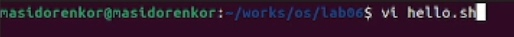{#fig:001 width=70%}

3) Я нажал клавишу i и ввел следующий текст

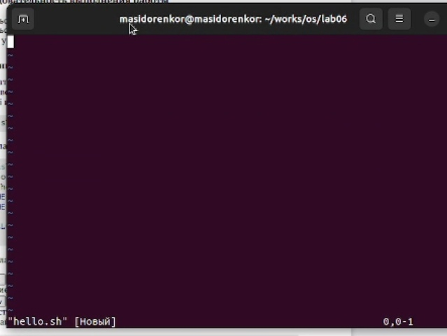{#fig:001 width=70%}

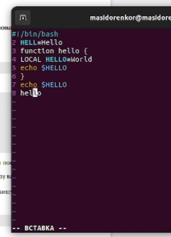{#fig:001 width=70%}

4) Нажал клавишу Esc для перехода в командный режим после завершения ввода
текста.

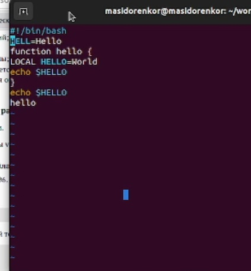{#fig:001 width=70%}

5) Нажал : для перехода в режим последней строки и внизу моего экрана появится
приглашение в виде двоеточия. Нажал w (записать) и q (выйти), а затем нажал клавишу Enter для сохранения моего текста и завершения работы.
 
{#fig:001 width=70%}

6) Сделал файл исполняемым

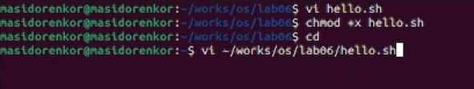{#fig:001 width=70%}

7) Вызовал vi на редактирование файла

{#fig:001 width=70%}

8) Установил курсор в конец слова HELL второй строки. Перешёл в режим вставки и заменил на HELLO. Нажал Esc для возврата в командный режим.

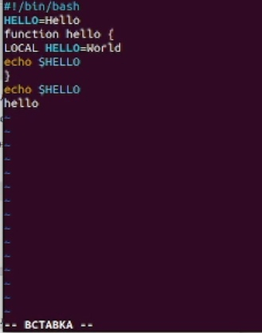{#fig:001 width=70%}

9) Перешёл в режим вставки и набрал следующий текст: local, нажал Esc для возврата в командный режим. 

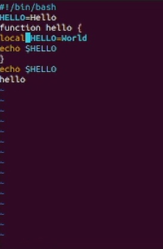{#fig:001 width=70%}

10) Установил курсор на последней строке файла. Вставил после неё строку, содержащую следующий текст: echo $HELLO.

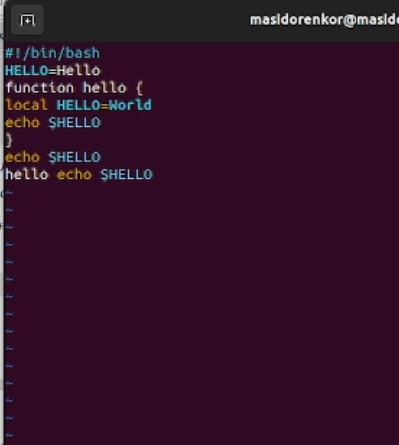{#fig:001 width=70%}

11) Нажал Esc для перехода в командный режим.

{#fig:001 width=70%}

12) Удалил последнюю строку.

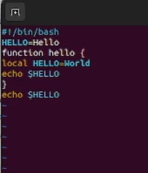{#fig:001 width=70%}

13) Ввел команду отмены изменений u для отмены последней команды.

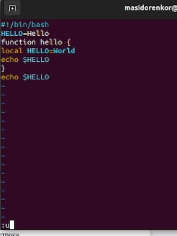{#fig:001 width=70%}

14) Ввел символ : для перехода в режим последней строки. Записал произведённые
изменения и выйдите из vi.

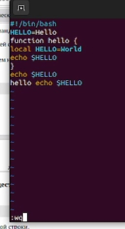{#fig:001 width=70%}

# Контрольные вопросы

1. Дайте краткую характеристику режимам работы редактора vi.
2. Как выйти из редактора, не сохраняя произведённые изменения?
3. Назовите и дайте краткую характеристику командам позиционирования.
4. Что для редактора vi является словом?
5. Каким образом из любого места редактируемого файла перейти в начало (конец)
файла?
6. Назовите и дайте краткую характеристику основным группам команд редактирова-
ния.
7. Необходимо заполнить строку символами $. Каковы ваши действия?
8. Как отменить некорректное действие, связанное с процессом редактирования?
9. Назовите и дайте характеристику основным группам команд режима последней стро-
ки.
10. Как определить, не перемещая курсора, позицию, в которой заканчивается строка?
11. Выполните анализ опций редактора vi (сколько их, как узнать их назначение и т.д.).
12. Как определить режим работы редактора vi?
13. Постройте граф взаимосвязи режимов работы редактора vi.

# Ответы на контрольные вопросы

1. Краткая характеристика режимов работы редактора vi: – командный режим — предназначен для ввода команд редактирования и навигации по
редактируемому файлу; – режим вставки — предназначен для ввода содержания редактируемого файла; – режим последней (или командной) строки
— используется для записи изменений в файл и выхода из редактора.
2. Выйти из редактора, не сохраняя произведённые изменения, можно используя клавиши «:q!» в командном режиме.
3. Краткую характеристика команд позиционирования: – 0 (ноль) — переход в
начало строки; – $ — переход в конец строки; – G — переход в конец файла;
– n G — переход на строку с номером n.
4. Для редактора vi словом является: пробел; буквы, находящиеся между двумя
пробелами.
5. Из любого места редактируемого файла перейти в конец файла можно с
помощью клавишы G и курсора вниз, а в начало – курсор вверх.
6. Краткая характеристика основных групп команд редактирования: Вставка
текста – а — вставить текст после курсора; – А — вставить текст в конец
строки; – i — вставить текст перед курсором; – n i — вставить текст n раз; –
I — вставить текст в начало строки. Вставка строки – о — вставить строку
под курсором; – О — вставить строку над курсором. Удаление текста – x —
удалить один символ в буфер; – d w — удалить одно слово в буфер; – d $ — удалить в буфер текст от курсора до конца строки; – d 0 — удалить в буфер
текст от начала строки до позиции курсора; – d d — удалить в буфер одну
строку; – n d d — удалить в буфер n строк. Отмена и повтор произведённых
изменений – u — отменить последнее изменение; –.— повторить последнее
изменение. Копирование текста в буфер – Y — скопировать строку в буфер;
– n Y — скопировать n строк в буфер; – y w — скопировать слово в буфер.
Вставка текста из буфера – p — вставить текст из буфера после курсора; – P
— вставить текст из буфера перед курсором. Замена текста – c w — заменить
слово; – n c w — заменить n слов; – c $ — заменить текст от курсора до конца
строки; – r — заменить слово; – R — заменить текст. Поиск текста – / текст
— произвести поиск вперёд по тексту указанной строки символов текст; –
? текст — произвести поиск назад по тексту указанной строки символов
текст.
7. Чтобы заполнить строку символами $ можно использовать клавиши ni(вставить текст n раз).
8. Отменить некорректное действие, связанное с процессом редактирования,
можно с помощью клавиши «.».
9. Характеристика основных групп команд режима последней строки: Копирование и перемещение текста – : n,m d — удалить строки с n по m; – : i,j m
k — переместить строки с i по j, начиная со строки k; – : i,j t k — копировать
строки с i по j в строку k; – : i,j w имя-файла — записать строки с i по j в файл
с именем имя-файла. Запись в файл и выход из редактора – : w — записать
изменённый текст в файл, не выходя из vi; – : w имя-файла — записать
изменённый текст в новый файл с именем имяфайла; – : w ! имя-файла —
записать изменённый текст в файл с именем имяфайла; – : w q — записать
изменения в файл и выйти из vi; – : q — выйти из редактора vi; – : q ! —
выйти из редактора без записи; – : e ! — вернуться в командный режим,
отменив все изменения, произведённые со времени последней записи.10. Определить, не перемещая курсора, позицию, в которой заканчивается
строка, можно используя клавишу $ (переход в конец строки).
11. Опции редактора vi позволяют настроить рабочую среду. Для задания опций используется команда set (в режиме последней строки): – : set all —
вывести полный список опций; – : set nu — вывести номера строк; – : set
list — вывести невидимые символы; – : set ic — не учитывать при поиске,
является ли символ прописным или строчным. Если вы хотите отказаться от
использования опции,то в команде set перед именем опции надо поставить
no.
12. Определить режим работы редактора vi можно по последней командной
строке.
13. Взаимосвязь режимов работы редактора vi: «Командный режим» - «Режим
вставки» / «Режим командной строки» 

# Вывод

После проделанной, я познакомился с операционной системой Linux. Получил практические навыки работы с редактором vi, установленным по умолчанию практически во всех дистрибутивах.

::: {#refs}
:::
