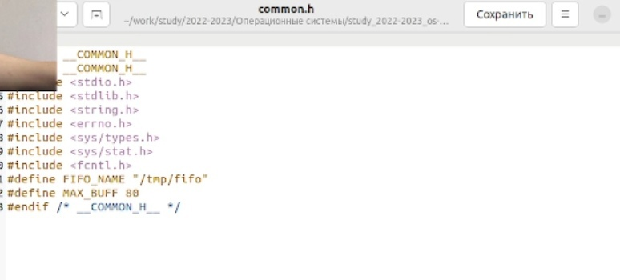
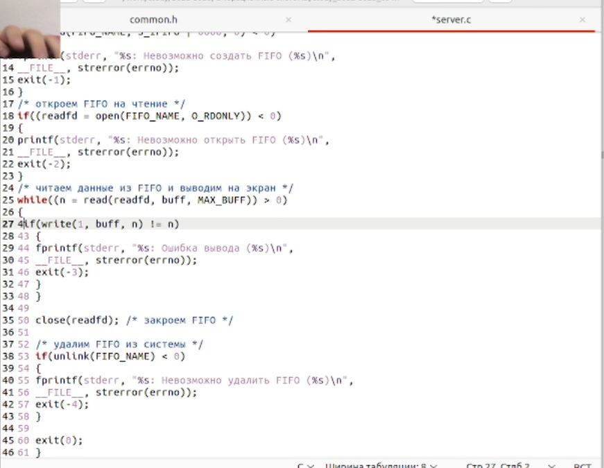
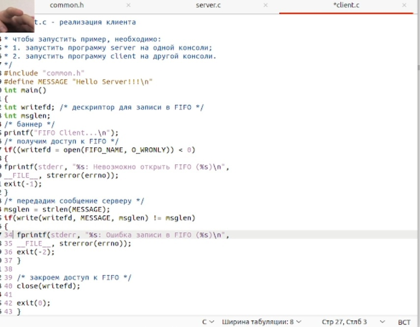
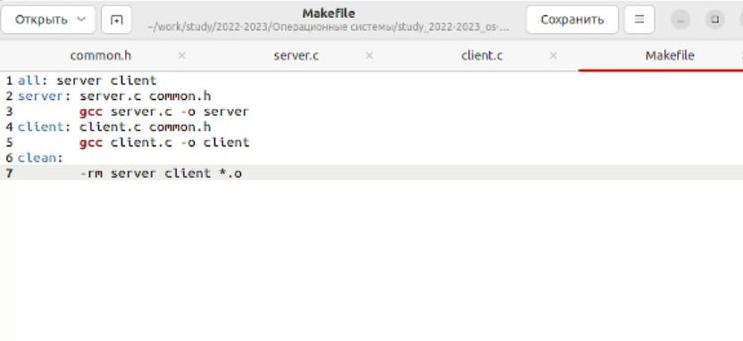
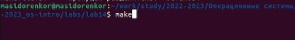
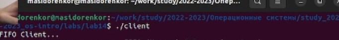

---
## Front matter
lang: ru-RU
title: Презентация лабораторной работы №14
author:
  - Сидоренко Максим Алексеевич
  - Группа НБИбд-02-22
institute:
  - Российский университет дружбы народов, Москва, Россия

## i18n babel
babel-lang: russian
babel-otherlangs: english

## Formatting pdf
toc: false
toc-title: Содержание
slide_level: 2
aspectratio: 169
section-titles: true
theme: metropolis
header-includes:
 - \metroset{progressbar=frametitle,sectionpage=progressbar,numbering=fraction}
 - '\makeatletter'
 - '\beamer@ignorenonframefalse'
 - '\makeatother'
---

# Цель работы 

## Цель работы

- Приобретение практических навыков работы с именованными каналами.

# Последовательность выполнения работы

## Последовательность выполнения работы

- Изучить приведённые в тексте программы server.c и client.c. Взяв данные примеры
за образец, напишите аналогичные программы, внеся следующие изменения:

## Последовательность выполнения работы

1. Работает не 1 клиент, а несколько (например, два).

## Последовательность выполнения работы

2. Клиенты передают текущее время с некоторой периодичностью (например, раз в пять
секунд). Используйте функцию sleep() для приостановки работы клиента.

## Последовательность выполнения работы

3. Сервер работает не бесконечно, а прекращает работу через некоторое время (напри-
мер, 30 сек). Используйте функцию clock() для определения времени работы сервера.
Что будет в случае, если сервер завершит работу, не закрыв канал?

# Создание файлов server.c, client.c common.h, Makefile
## Создание файлов server.c, client.c common.h, Makefile

{#fig:001 width=70%}

## Создание файлов server.c, client.c common.h, Makefile

{#fig:001 width=70%}

# Редактирование созданных файлов
## Редактирование созданных файлов

{#fig:001 width=70%}

## Редактирование созданных файлов

{#fig:001 width=70%}

## Редактирование созданных файлов

{#fig:001 width=70%}

## Редактирование созданных файлов

{#fig:001 width=70%}

# Компиляция файлов с помощью make
## Компиляция файлов с помощью make

{#fig:001 width=70%}

## Компиляция файлов с помощью make

{#fig:001 width=70%}

# Проверка работы созданных файлов
## Проверка работы созданных файлов

{#fig:001 width=70%}

# Ответы на контрольные вопросы

1. Именованные каналы отличаются от неименованных наличием идентифи-
катора канала, который представлен как специальный файл (соответствен-
но имя именованного канала − это имя файла). Поскольку файл находится
на локальной файловой системе, данное IPC используется внутри одной
системы.
2. Чтобы создать неименованный канал из командной строки нужно использо-
вать символ |, служащий для объединения двух и более процессов: процесс_1
| процесс_2 | процесс_3...
3. Чтобы создать именованный канал из командной строки нужно использо-
вать либо команду «mknod », либо команду «mkfifo ».
4. Неименованный канал является средством взаимодействия между связан-
ными процессами − родительским и дочерним. Родительский процесс со-
здает канал при помощи системного вызова: «int pipe(int fd[2]);». Массив из
двух целых чисел является выходным параметром этого системного вызова.
Если вызов выполнился нормально, то этот массив содержит два файловых
дескриптора. fd[0] является дескриптором для чтения из канала, fd[1] − де-
скриптором для записи в канал. Когда процесс порождает другой процесс,
дескрипторы родительского процесса наследуются дочерним процессом,
и, таким образом, прокладывается трубопровод между двумя процессами.
Естественно, что один из процессов использует канал только для чтения, а
другой − только для записи. Поэтому, если, например, через канал должны 
передаваться данные из родительского процесса в дочерний, родительский
процесс сразу после запуска дочернего процесса закрывает дескриптор
канала для чтения, а дочерний процесс закрывает дескриптор для записи.
Если нужен двунаправленный обмен данными между процессами, то ро-
дительский процесс создает два канала, один из которых используется для
передачи данных в одну сторону, а другой − в другую.
5. Файлы именованных каналов создаются функцией mkfifo() или функцией
mknod: • «int mkfifo(const char pathname, mode_t mode);», где первый параметр
− путь, где будет располагаться FIFO (имя файла, идентифицирующего канал),
второй параметр определяет режим работы с FIFO (маска прав доступа к
файлу), • «mknod (namefile, IFIFO | 0666, 0)», где namefile − имя канала, 0666 −
к каналу разрешен доступ на запись и на чтение любому запросившему про-
цессу), • «int mknod(const char pathname, mode_t mode, dev_t dev);». Функция
mkfifo() создает канал и файл соответствующего типа. Если указанный файл
канала уже существует, mkfifo() возвращает -1. После создания файла канала
процессы, участвующие в обмене данными, должны открыть этот файл либо
для записи, любо для чтения.
6. При чтении меньшего числа байтов, чем находится в канале или FIFO, воз-
вращается требуемое число байтов, остаток сохраняется для последующих
чтений. При чтении большего числа байтов, чем находится в канале или
FIFO, возвращается доступное число байтов. Процесс, читающий из канала,
должен соответствующим образом обработать ситуацию, когда прочитано
меньше, чем заказано.
7. Запись числа байтов, меньшего емкости канала или FIFO, гарантированно
атомарно. Это означает, что в случае, когда несколько процессов одновре-
менно записывают в канал, порции данных от этих процессов не переме-
шиваются. При записи большего числа байтов, чем это позволяет канал или
FIFO, вызов write(2) блокируется до освобождения требуемого места. При
этом атомарность операции не гарантируется. Если процесс пытается запи-
сать данные в канал, не открытый ни одним процессом на чтение, процессу
генерируется сигнал SIGPIPE, а вызов write(2) возвращает 0 с установкой
ошибки (errno=ERRPIPE) (если процесс не установил обработки сигнала
SIGPIPE, производится обработка по умолчанию − процесс завершается).
8. Количество процессов, которые могут параллельно присоединяться к лю-
бому концу канала, не ограничено. Однако если два или более процесса
записывают в канал данные одновременно, каждый процесс за один раз
может записать максимум PIPE BUF байтов данных. Предположим, процесс
(назовем его А) пытается записать X байтов данных в канал, в котором
имеется место для Y байтов данных. Если X больше, чем Y, только первые Y
байтов данных записываются в канал, и процесс блокируется. Запускается
другой процесс (например. В); в это время в канале появляется свобод-
ное пространство (благодаря третьему процессу, считывающему данные из
канала). Процесс В записывает данные в канал. Затем, когда выполнение
процесса А возобновляется,он записывает оставшиеся X-Y байтов данных в
канал. В результате данные в канал записываются поочередно двумя процес-
сами. Аналогичным образом, если два (или более) процесса одновременно
попытаются прочитать данные из канала, может случиться так, что каждый
из них прочитает только часть необходимых данных.
9. Функция write записывает байты count из буфера buffer в файл, связан-
ный с handle. Операции write начинаются с текущей позиции указателя
на файл (указатель ассоциирован с заданным файлом). Если файл открыт
для добавления, операции выполняются в конец файла. После осуществ-
ления операций записи указатель на файл (если он есть) увеличивается на
количество действительно записанных байтов. Функция write возвращает
число действительно записанных байтов. Возвращаемое значение должно
быть положительным, но меньше числа count (например, когда размер для
записи count байтов выходит за пределы пространства на диске). Возвра-
щаемое значение -1 указывает на ошибку; errno устанавливается в одно из
следующих значений: EACCES − файл открыт для чтения или закрыт для
записи, EBADF − неверный handle-р файла, ENOSPC − на устройстве нет
свободного места. Единица в вызове функции write в программе server.c
означает идентификатор (дескриптор потока) стандартного потока вывода.
10. Прототип функции strerror: «char * strerror( int errornum );». Функция strerror
интерпретирует номер ошибки, передаваемый в функцию в качестве аргу-
мента − errornum, в понятное для человека текстовое сообщение (строку).
Откуда берутся эти ошибки? Ошибки эти возникают при вызове функций
стандартных Си-библиотек. То есть хорошим тоном программирования
будет − использование этой функции в паре с другой, и если возникнет
ошибка, то пользователь или программист поймет, как исправить ошибку,
прочитав сообщение функции strerror. Возвращенный указатель ссылает-
ся на статическую строку с ошибкой, которая не должна быть изменена
программой. Дальнейшие вызовы функции strerror перезапишут содер-
жание этой строки. Интерпретированные сообщения об ошибках могут
различаться, это зависит от платформы и компилятора.

# Вывод

- После проделанной, я приобрел практические навыки работы с именованными каналами.

:::

